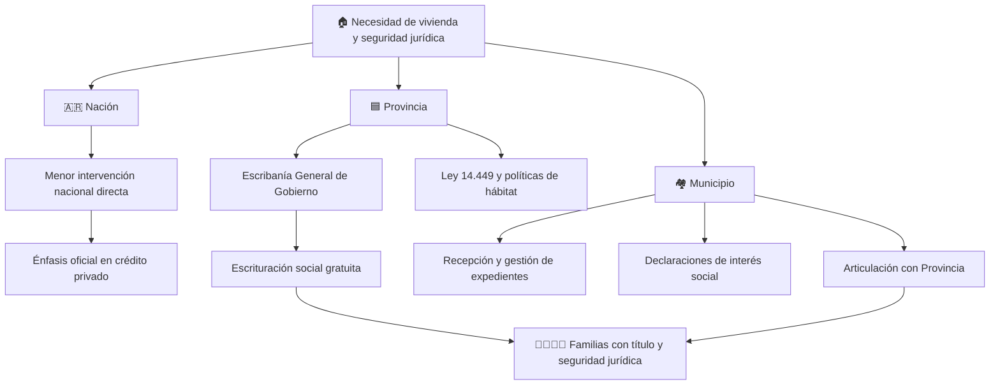

# 🏠 71 escrituras: más familias de General Las Heras avanzan con la propiedad legal de sus hogares

Tener una casa y **tener legalmente la escritura de esa casa no siempre son la misma cosa**.

Para muchas familias pasan años entre la compra, la adjudicación o la ocupación legítima de una vivienda y el momento en que finalmente pueden acreditar formalmente la titularidad ante el Estado.

El viernes 18 de septiembre, según informó el Municipio de General Las Heras, se realizó una nueva jornada de **firma de 71 escrituras** con intervención de la **Escribanía General de Gobierno de la Provincia de Buenos Aires** y acompañamiento de la escribana **Rosa Borda**.

Las actuaciones fueron encuadradas en las leyes provinciales **10.830** y **14.449**, dos herramientas vinculadas a la regularización dominial, la escrituración social y el acceso al hábitat.

---

## ✍️ ¿Qué cambia concretamente para una familia?

Una escritura no es simplemente un papel guardado en una carpeta.

Cuando el proceso queda completado e inscripto, el título permite acreditar jurídicamente quién es propietario del inmueble y puede facilitar distintos trámites posteriores.

Entre otras cosas, la regularización dominial puede permitir:

- 🏠 acreditar formalmente la titularidad de la vivienda;
- 👨‍👩‍👧‍👦 ordenar una futura sucesión familiar;
- 🛡️ tramitar la protección de la vivienda cuando corresponda;
- 🏦 acreditar el inmueble frente a determinados trámites bancarios o crediticios;
- 🔨 avanzar con operaciones y mejoras que requieren documentación dominial;
- ⚖️ contar con mayor seguridad jurídica ante conflictos sobre la propiedad.

La propia Provincia explica que la escrituración social busca que sectores con menos recursos puedan acceder al título de propiedad y que, en las operatorias comprendidas por la **Ley 10.830**, la intervención de la Escribanía General de Gobierno puede realizarse **de manera gratuita** para quienes cumplen los requisitos de interés social.

👉 [Escrituración Social Gratuita — Provincia de Buenos Aires](https://www.gba.gob.ar/node/10286)

---

## 📜 Ley 10.830: cuando escriturar de manera privada es demasiado caro

La **Ley 10.830** regula la Escribanía General de Gobierno bonaerense y permite que el organismo intervenga en procesos de **regularización dominial de interés social** solicitados por la Provincia o los municipios.

En estos casos, la Provincia informa que la escritura puede otorgarse sin costo para familias comprendidas en el régimen social.

Entre los beneficios que históricamente ha informado la Escribanía se encuentran, según la situación particular:

- ✅ gratuidad del trámite de escrituración;
- ✅ gratuidad de tasas registrales;
- ✅ exención del Impuesto de Sellos;
- ✅ posibilidad de condonación de determinadas deudas provinciales o municipales;
- ✅ diligenciamiento y actuación notarial sin costo para la familia.

Esto no significa que **cualquier inmueble automáticamente pueda escriturarse gratis**: cada expediente debe cumplir los requisitos legales y ser declarado de interés social cuando corresponda.

👉 [Operatorias vinculadas a la Escribanía General](https://www.gba.gob.ar/escribaniageneral/escrituracion_social/operatorias_vinculadas_la_egg)

👉 [Requisitos de la Ley 10.830](https://www.gba.gob.ar/static/escribania_general/docs/Requisitos.pdf)

---

## 🌱 Ley 14.449: la vivienda no termina en las cuatro paredes

La otra norma mencionada en la jornada es la **Ley bonaerense 14.449 de Acceso Justo al Hábitat**, actualmente vigente.

La ley establece que las políticas provinciales y municipales deben trabajar progresivamente sobre cuestiones como:

- 🏘️ acceso a vivienda y suelo;
- 🌾 generación de suelo urbanizable también en zonas rurales;
- 🚰 servicios e infraestructura;
- 🧱 lotes con servicios;
- 🏡 urbanizaciones sociales;
- 📑 regularización dominial;
- 👥 prioridad para familias que no pueden resolver su necesidad habitacional únicamente con recursos propios.

Un punto particularmente importante para una comunidad con localidades y zonas rurales como General Las Heras es que la norma **menciona expresamente tanto centros urbanos como asentamientos rurales**.

Además, su artículo 8 contempla que Provincia y municipios deben asegurar, en coordinación con la Escribanía General de Gobierno, la regularización dominial y la gestión escrituraria.

👉 [Ley 14.449 actualizada — texto completo](https://www.argentina.gob.ar/normativa/provincial/ley-14449-123456789-0abc-defg-944-4100bvorpyel/actualizacion)

---

## 🏘️ General Las Heras ya había adherido a esta herramienta

El Concejo Deliberante local registra que General Las Heras adhirió al régimen de la **Ley 14.449** mediante la **Ordenanza 0288/2017**, vinculada al programa de Lotes con Servicios.

Eso permite entender la jornada actual como parte de una política que viene utilizando distintas herramientas jurídicas para facilitar suelo, vivienda y regularización de títulos.

👉 [Ordenanzas del Concejo Deliberante de General Las Heras](https://hcdlasheras.com/ordenanzas/)

---

## 📊 No es la primera jornada reciente: así viene la regularización dominial

El proceso no comenzó esta semana.

En los últimos meses y años se registraron distintas jornadas de firmas y entregas en General Las Heras.

| Fecha | Medida informada | Cantidad |
|---|---|---:|
| **01/12/2025** | Entrega de escrituras gratuitas mediante Provincia y Municipio | **133 escrituras** |
| **26/06/2026** | Firmas bajo leyes nacionales 24.374 y 25.797 | **10 familias** |
| **18/09/2026** | Nueva firma bajo leyes bonaerenses 10.830 y 14.449 | **71 escrituras** |

En diciembre de 2025, el Ministerio de Hábitat bonaerense informó oficialmente la **entrega de 133 escrituras gratuitas** en el distrito.

👉 [Provincia: 133 escrituras entregadas en General Las Heras](https://www.gba.gob.ar/node/51676)

En junio de este año, otras **10 familias** avanzaron con trámites de regularización mediante las leyes nacionales 24.374 y 25.797, en articulación con la Subsecretaría Social de Tierras, Urbanismo y Vivienda bonaerense.

👉 [Código Baires: nuevas firmas en General Las Heras — 26/06/2026](https://www.codigobaires.com.ar/2026-06-26/general-las-heras-avanza-con-la-entrega-de-escrituras-de-viviendas-249179/)

<strong>📌 Una aclaración importante: firmar y recibir no siempre son la misma etapa</strong>

En este tipo de operatorias puede existir una diferencia entre:

1. iniciar el expediente;
2. aprobar la escrituración;
3. firmar el instrumento;
4. inscribirlo en el Registro de la Propiedad;
5. entregar finalmente el título a la familia.

Por eso Villars Informa utiliza **“firma de 71 escrituras”**, que es lo informado para esta jornada, y no afirma que las 71 familias hayan recibido ese mismo día el título definitivo ya registrado si esa etapa no fue detallada públicamente.

---

## 🧭 Nación, Provincia y Municipio: tres niveles, políticas distintas

La vivienda permite ver con claridad cómo una misma necesidad puede ser abordada de manera diferente por cada nivel del Estado.

| Nivel | Política actualmente verificable |
|---|---|
| 🇦🇷 **Nación** | El Gobierno Nacional disolvió PROCREAR y luego la Secretaría de Desarrollo Territorial, Hábitat y Vivienda. Su política declarada trasladó mayor responsabilidad habitacional hacia provincias y municipios y prioriza el desarrollo del crédito privado. |
| 🟦 **Provincia de Buenos Aires** | Mantiene programas de escrituración social y regularización dominial mediante la Escribanía General de Gobierno, además de políticas de vivienda y hábitat. |
| 🏘️ **General Las Heras** | Recibe expedientes, articula trámites locales, aplica instrumentos de acceso al hábitat y coordina jornadas con organismos provinciales. |

### 🇦🇷 ¿Qué cambió a nivel nacional?

En noviembre de 2024 el Gobierno Nacional **disolvió el fondo fiduciario PROCREAR**.

En febrero de 2025 completó además la **disolución de la Secretaría de Desarrollo Territorial, Hábitat y Vivienda**. En su comunicación oficial sostuvo que la construcción pública nacional de viviendas debía reducirse y que este tipo de políticas debían quedar principalmente en manos de **provincias y municipios**, mientras el Gobierno Nacional apuesta al crecimiento del crédito privado.

Esa es una **decisión de política pública explícita del Gobierno Nacional**, no una interpretación de Villars Informa.

👉 [Gobierno Nacional: disolución de PROCREAR](https://www.argentina.gob.ar/noticias/el-gobierno-dispuso-la-disolucion-del-fondo-fiduciario-publico-procrear)

👉 [Gobierno Nacional: disolución de la Secretaría de Hábitat y Vivienda](https://www.argentina.gob.ar/noticias/se-completo-la-disolucion-de-la-secretaria-de-desarrollo-territorial-habitat-y-vivienda)

### 🟦 ¿Qué hace la Provincia?

Mientras Nación redujo su participación directa en este tipo de políticas, la Provincia de Buenos Aires **continúa operando mecanismos públicos de escrituración social**.

En agosto de 2026, por ejemplo, la Escribanía General informó la entrega de **1.521 escrituras gratuitas en Almirante Brown**, mostrando que el programa provincial sigue activo.

👉 [Provincia: 1.521 escrituras entregadas en agosto de 2026](https://www.gba.gob.ar/escribaniageneral/noticias/kicillof_entreg%C3%B3_m%C3%A1s_de_1500_escrituras_familias_de_almirante_brown)

La diferencia entre ambos enfoques es concreta:

No son exactamente las mismas herramientas ni cumplen la misma función, pero el contraste permite saber **qué nivel del Estado está interviniendo actualmente en cada etapa**.

---

## 💰 ¿Por qué esto importa especialmente para una familia trabajadora?

Porque escriturar en forma privada tiene costos.

Honorarios profesionales, trámites registrales, impuestos, informes y documentación pueden convertirse en una barrera importante para una familia cuyos ingresos se destinan principalmente a alimentos, servicios, transporte y mantenimiento de la vivienda.

La escrituración social intenta resolver precisamente ese problema: que **tener pocos recursos no impida consolidar jurídicamente una propiedad legítima**.

La Provincia define esta herramienta como destinada especialmente a sectores de menores recursos y señala que el trámite puede realizarse de manera totalmente gratuita cuando se cumplen las condiciones.

👉 [Provincia — Escrituras sociales](https://www.gba.gob.ar/node/2195)

---

## 🌾 También importa para Villars, Hornos, Plomer y la zona rural

Hablar de vivienda en General Las Heras no significa pensar únicamente en el casco urbano.

La Ley 14.449 contempla expresamente la generación de suelo y políticas habitacionales en **zonas rurales**, algo especialmente relevante para un distrito con localidades pequeñas, quintas, chacras y viviendas alejadas de los principales centros administrativos.

Para una familia rural, contar con documentación clara sobre un lote o una vivienda puede ser fundamental para:

- acreditar propiedad;
- hacer trámites de servicios;
- ordenar sucesiones;
- vender o transferir legalmente cuando corresponda;
- evitar conflictos de límites o titularidad;
- acceder a futuras obras o programas de infraestructura.

---

## 🔎 ¿La escritura significa que el problema de vivienda está resuelto?

**No necesariamente.**

La regularización dominial resuelve una parte muy importante: **la seguridad jurídica de quien ya posee o habita una vivienda o terreno dentro de determinadas condiciones legales**.

Pero el acceso al hábitat también incluye otras cuestiones:

- precio y disponibilidad de lotes;
- alquileres;
- construcción de nuevas viviendas;
- acceso al crédito;
- agua y cloacas;
- electricidad;
- calles y transporte;
- conectividad;
- cercanía a escuelas y centros de salud.

Por eso una política integral de vivienda debe mirarse más allá del número de escrituras entregadas.

Una familia puede tener título de propiedad y seguir necesitando **agua segura, caminos transitables o infraestructura**. Y otra familia puede tener ingresos estables pero no encontrar un lote o crédito accesible para construir.

---

## ✅ Qué está confirmado y qué queda por verificar

### Confirmado por normativa y antecedentes oficiales

- La **Ley 10.830** regula la intervención de la Escribanía General de Gobierno en regularizaciones de interés social.
- La Provincia mantiene vigente la **escrituración social gratuita**.
- La **Ley 14.449** sigue vigente y establece políticas de acceso justo al hábitat.
- General Las Heras está adherido al régimen provincial de la Ley 14.449.
- En diciembre de 2025 fueron entregadas **133 escrituras gratuitas** en General Las Heras.
- En junio de 2026 otras **10 familias** firmaron documentación de regularización dominial.
- A nivel nacional fueron disueltos PROCREAR y la Secretaría nacional de Hábitat y Vivienda.

### Información correspondiente a la publicación municipal de esta jornada

- **71 escrituras firmadas**.
- Jornada realizada el **viernes 18 de septiembre de 2026**.
- Intervención de la Escribanía General de Gobierno.
- Participación de la escribana **Rosa Borda**.
- Trámites encuadrados en las leyes **10.830 y 14.449**.

📌 **Al cierre de esta nota, la jornada de las 71 firmas todavía no aparecía detallada en una gacetilla separada de la Escribanía General de Gobierno consultable por nuestro medio.** Por ese motivo, esos datos puntuales son atribuidos a la comunicación oficial municipal.

---

## ❤️ Un papel que cambia mucho más de lo que parece

Para quien nunca tuvo problemas de títulos, sucesiones o regularización de un terreno, una escritura puede parecer simplemente otro trámite administrativo.

Para quien esperó años, puede significar algo completamente distinto: **saber que la casa construida con décadas de trabajo finalmente está respaldada legalmente a nombre de la familia**.

La nueva jornada de 71 firmas se suma así a un proceso que ya tuvo otras instancias recientes en General Las Heras y muestra una política concreta de articulación entre Municipio y Provincia.

La tarea siguiente es que esas políticas lleguen también a quienes todavía esperan su expediente, especialmente en las localidades y sectores rurales donde muchas veces **la distancia, la falta de información y los costos administrativos hacen todavía más difícil acceder a estos trámites**.

> 🏡 **La vivienda no es solamente tener un techo: también es tener seguridad sobre ese techo, servicios alrededor y la posibilidad de construir un futuro sobre bases firmes.**

---

## 📚 Fuentes consultadas

- **Publicación oficial del Municipio de General Las Heras suministrada como noticia base** — jornada del 18/09/2026 con 71 firmas bajo leyes 10.830 y 14.449.

- **Escribanía General de Gobierno de la Provincia de Buenos Aires** — Escrituración Social Gratuita:  
  https://www.gba.gob.ar/node/10286

- **Escribanía General de Gobierno** — Operatorias vinculadas y Ley 10.830:  
  https://www.gba.gob.ar/escribaniageneral/escrituracion_social/operatorias_vinculadas_la_egg

- **Escribanía General de Gobierno** — Requisitos de escrituración por Ley 10.830:  
  https://www.gba.gob.ar/static/escribania_general/docs/Requisitos.pdf

- **Provincia de Buenos Aires** — Escrituras sociales:  
  https://www.gba.gob.ar/node/2195

- **Ley bonaerense 14.449 de Acceso Justo al Hábitat — texto actualizado**:  
  https://www.argentina.gob.ar/normativa/provincial/ley-14449-123456789-0abc-defg-944-4100bvorpyel/actualizacion

- **Honorable Concejo Deliberante de General Las Heras** — Ordenanzas, incluida la adhesión local a la Ley 14.449:  
  https://hcdlasheras.com/ordenanzas/

- **Ministerio de Hábitat y Desarrollo Urbano bonaerense** — 133 escrituras entregadas en General Las Heras, 01/12/2025:  
  https://www.gba.gob.ar/node/51676

- **Código Baires** — Regularización dominial de 10 familias de General Las Heras, 26/06/2026:  
  https://www.codigobaires.com.ar/2026-06-26/general-las-heras-avanza-con-la-entrega-de-escrituras-de-viviendas-249179/

- **Gobierno Nacional** — Disolución de PROCREAR, Decreto 1018/2024:  
  https://www.argentina.gob.ar/noticias/el-gobierno-dispuso-la-disolucion-del-fondo-fiduciario-publico-procrear

- **Gobierno Nacional** — Disolución de la Secretaría de Desarrollo Territorial, Hábitat y Vivienda:  
  https://www.argentina.gob.ar/noticias/se-completo-la-disolucion-de-la-secretaria-de-desarrollo-territorial-habitat-y-vivienda

- **Escribanía General de Gobierno bonaerense** — continuidad del programa provincial en 2026:  
  https://www.gba.gob.ar/escribaniageneral/noticias/kicillof_entreg%C3%B3_m%C3%A1s_de_1500_escrituras_familias_de_almirante_brown

---

**Redacción, investigación y adaptación: Villars Informa.**

Artículo elaborado a partir de la información municipal de la jornada, normativa vigente, documentación oficial de la Provincia y Nación, antecedentes locales y medios bonaerenses. **La redacción es propia**, con contexto agregado para explicar cómo funciona la escrituración social, qué hace cada nivel del Estado y qué efectos concretos tiene para las familias del distrito.
