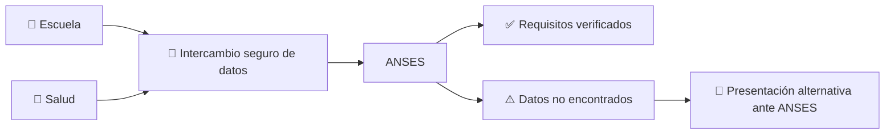

# 📲 AUH: salud y escolaridad se acreditarán automáticamente para cobrar el 20% retenido

El Gobierno nacional modificó uno de los trámites más conocidos por las familias que cobran la **Asignación Universal por Hijo (AUH)**.

A partir de la **Resolución 508/2026**, ANSES podrá verificar automáticamente el cumplimiento de los controles de salud, vacunación y escolaridad mediante información enviada por el **Ministerio de Salud** y la **Secretaría de Educación**.

En los casos en los que el sistema encuentre correctamente los datos, la familia **ya no tendrá que llevar certificados en papel para acreditar esos requisitos**.

👉 [Resolución 508/2026 — texto oficial](https://www.argentina.gob.ar/normativa/nacional/norma-430200/texto)

👉 [Boletín Oficial — publicación del 17/09/2026](https://www.boletinoficial.gob.ar/detalleAviso/primera/347574/20260917)

👉 [Comunicado del Ministerio de Capital Humano](https://www.argentina.gob.ar/noticias/la-acreditacion-de-salud-y-escolaridad-de-la-auh-se-realizara-de-forma-automatica)

---

## ✅ ¿Qué cambia realmente?

Hasta ahora, para liberar el porcentaje reservado de la AUH, muchas familias tenían que completar la Libreta con la información de salud y escuela y hacer llegar esa documentación a ANSES.

Con el nuevo esquema:

### Cuando el cruce funciona

- 🏥 Salud informa los controles correspondientes.
- 🎒 Educación informa el cumplimiento del ciclo escolar.
- 🔐 Los organismos intercambian los datos.
- ✅ ANSES puede acreditar el cumplimiento sin exigir el papel a la familia.

### Cuando el cruce no funciona

La persona **no pierde automáticamente el derecho** por un dato faltante.

La resolución mantiene una vía alternativa: el titular podrá presentar la documentación a ANSES mediante los procedimientos que el organismo determine.

---

# 🚨 Lo más importante: esto NO elimina la retención del 20%

Algunos titulares pueden llevar a confusión.

Para quienes tienen hijos **desde los 5 años**, la AUH continúa funcionando con el esquema general:

- **80%** se paga mensualmente.
- **20%** queda reservado.
- ese 20% se libera cuando se acredita el cumplimiento de las condiciones correspondientes.

La novedad consiste en que esa acreditación podrá hacerse **automáticamente**.

> 📌 **La medida simplifica el trámite. No convierte automáticamente la AUH de 5 a 17 años en un pago mensual del 100%.**

El propio texto de la Resolución 508/2026 mantiene expresamente el porcentaje reservado establecido por la Ley 24.714.

---

## 👶 ¿Y qué pasa con los menores de hasta 4 años?

Acá hay una diferencia importante.

Para niños y niñas de **hasta 4 años inclusive**, si ANSES verifica automáticamente los controles sanitarios y el calendario de vacunación, la resolución dispone que el **20% reservado se liquide automáticamente y de forma mensual junto con el 80%**.

Ese mecanismo había comenzado a implementarse previamente y ahora la nueva norma amplía la verificación automática de las condicionalidades al resto de la AUH.

| Edad | Qué se verifica | Qué ocurre con el 20% |
|---|---|---|
| 👶 **0 a 4 años** | Salud + vacunación | Si se verifica automáticamente, puede liquidarse mensualmente con el 80% |
| 🎒 **Desde 5 años** | Salud + escolaridad | Continúa reservado hasta acreditación; ahora esa acreditación puede hacerse automáticamente |

---

## 💰 ¿Cuánto representa hoy ese 20%?

En septiembre de 2026, ANSES actualizó las asignaciones familiares un **2,11%**, mediante la Resolución 260/2026.

El valor bruto general difundido para la AUH es de aproximadamente **$154.031 por hijo**.

Tomando ese valor redondeado:

| Concepto | Aproximado por hijo |
|---|---:|
| AUH total | **$154.031** |
| 80% mensual | **$123.225** |
| 20% reservado | **$30.806** |

📌 Los importes pueden presentar diferencias mínimas por redondeos administrativos.

👉 [Resolución ANSES 260/2026 — actualización de septiembre](https://www.argentina.gob.ar/normativa/nacional/norma-429461/texto)

👉 [Boletín Oficial — Resolución 260/2026](https://www.boletinoficial.gob.ar/detalleAviso/primera/346684/20260901?anexos=1)

---

## 🧾 Una buena noticia administrativa, pero no es un aumento de ingresos

Para una familia trabajadora, una mejora burocrática puede ser importante aunque **no agregue un peso nuevo al monto de la prestación**.

La automatización puede ahorrar:

- 🚌 viajes hasta una oficina;
- ⛽ combustible;
- ⏰ horas fuera del trabajo;
- 🖨️ impresiones;
- 🏫 volver a la escuela sólo para conseguir una certificación;
- 🏥 trámites adicionales en centros de salud;
- 📄 riesgo de perder o presentar incorrectamente formularios.

Esto puede ser especialmente útil en **pueblos y zonas rurales**, donde una oficina pública puede quedar a varios kilómetros.

Pero hay que separar dos cosas:

> **Menos burocracia mejora el acceso al derecho. No es lo mismo que aumentar el valor económico del derecho.**

El monto de la AUH sigue determinado por las reglas de movilidad vigentes y el esquema de retención continúa para las edades escolares.

---

## 🌾 El punto sensible para la gente rural: que los datos realmente estén cargados

La automatización depende de que la información necesaria exista en las bases oficiales y pueda cruzarse correctamente.

La propia resolución prevé el problema: **si Salud o Educación no pueden aportar la información necesaria, el titular conserva la posibilidad de acreditar los requisitos por otra vía ante ANSES**.

Esto es particularmente relevante para:

- escuelas rurales;
- establecimientos pequeños;
- familias que cambiaron de escuela;
- personas atendidas en distintos efectores de salud;
- cambios de domicilio;
- datos administrativos que todavía no fueron actualizados.

No significa que esos casos vayan necesariamente a fallar. Significa que **la norma reconoce que el sistema automático puede no encontrar siempre la información y mantiene una alternativa**.

---

## ⚠️ ¿Ya tengo que olvidarme de la Libreta?

No conviene tirar nada todavía.

La Resolución 508/2026 está vigente desde el **17 de septiembre**, pero su artículo 2 dispone que **ANSES debe adoptar las medidas y normas necesarias para su aplicación**.

Además, cuando un dato no pueda comprobarse automáticamente seguirá existiendo una instancia alternativa.

### Recomendación práctica

1. 📱 Revisar **Mi ANSES**.
2. 👧 Verificar que los datos de hijos e hijas sean correctos.
3. 🏥 Mantener actualizados los controles de salud.
4. 🎒 Asegurarse de que la escolaridad esté correctamente registrada.
5. 📄 Conservar certificados y documentación hasta comprobar que ANSES efectivamente validó la información.

> **Automático no significa “desentenderse”: significa que, cuando las bases coinciden, el Estado hace el cruce sin obligar a la familia a transportar el papel de una oficina a otra.**

---

# 🏛️ ¿Qué hace cada nivel del Estado?

En este caso es bastante sencillo separar responsabilidades.

| Nivel | Qué hace |
|---|---|
| 🇦🇷 **Nación** | Administra la AUH mediante ANSES, fija las reglas de acreditación y gestiona el intercambio con Salud y Educación. |
| 🟦 **Provincia de Buenos Aires** | Administra gran parte del sistema educativo y sanitario bonaerense del que surgen datos que pueden alimentar las verificaciones; además mantiene políticas propias de acompañamiento al consumo. |
| 🏘️ **Municipios** | No pagan la AUH, pero los efectores municipales de salud y las áreas sociales pueden ser puntos clave para controles, orientación y acompañamiento territorial. |

La medida es nacional y **no corresponde adjudicar el pago de la AUH a Provincia o al municipio**.

---

# 🍎 AUH no es la única herramienta que llega a familias con chicos

Para entender el bolsillo familiar conviene mirar el conjunto de políticas que pueden convivir.

## 🇦🇷 Nación: Prestación Alimentar

En mayo de 2026 el Ministerio de Capital Humano actualizó los valores de la **Prestación Alimentar**, que se acredita automáticamente a familias que cumplen los requisitos.

Los montos vigentes establecidos por la Resolución 161/2026 son:

| Grupo familiar | Prestación Alimentar |
|---|---:|
| 👶 1 hijo/a | **$72.250** |
| 👧👦 2 hijos/as | **$113.299** |
| 👨‍👩‍👧‍👦 3 o más | **$149.425** |

La cobertura alcanza, entre otros grupos, a madres y padres con hijos de hasta **17 años inclusive** que cobran AUH.

👉 [Resolución 161/2026 — Prestación Alimentar](https://www.argentina.gob.ar/normativa/nacional/norma-425565/texto)

👉 [Información oficial de Prestación Alimentar](https://www.argentina.gob.ar/capital-humano/prestacion-alimentar)

---

## 🟦 Provincia: descuentos de Cuenta DNI

En septiembre siguen vigentes distintos beneficios de **Cuenta DNI**, la billetera del Banco Provincia.

Entre ellos se encuentran promociones en comercios de cercanía y un beneficio particularmente importante para familias que no tienen gas natural:

🔥 **40% de ahorro en garrafas**, con un tope de reintegro de **$18.000 por mes y por persona** durante septiembre, en comercios adheridos.

👉 [Banco Provincia — beneficio vigente en garrafas](https://www.bancoprovincia.com.ar/cuentadni/buscadores/garrafas)

También existen promociones en comercios y localidades adheridas, con condiciones y topes que varían según día y rubro.

📌 **Cuenta DNI no forma parte de la AUH y no es exclusiva para beneficiarios de la asignación.** Se incluye acá porque puede impactar en el mismo presupuesto familiar.

---

## 🏘️ ¿Y General Las Heras?

Al revisar la información disponible al cierre de esta nota **no encontramos un beneficio municipal específico vigente que modifique o complemente automáticamente el 20% retenido de la AUH**.

Esto es importante decirlo para no atribuir al municipio algo que corresponde a ANSES.

Sí existen áreas municipales de Desarrollo Social y efectores de salud que pueden intervenir en orientación, controles y acompañamiento territorial, pero **el reconocimiento y pago de la AUH es nacional**.

---

# 🔍 ¿La automatización puede generar problemas?

La norma intenta justamente reducir errores, pero ningún sistema de datos es infalible.

Los escenarios que habrá que observar en la práctica son:

- información escolar que todavía no aparece;
- controles sanitarios no asociados correctamente;
- cambios de escuela o domicilio;
- datos personales desactualizados;
- diferencias entre registros provinciales, municipales y nacionales.

El punto favorable de la resolución es que **no cierra la vía alternativa**.

Si el sistema no logra comprobar la información, ANSES podrá recibir documentación por el mecanismo que determine.

Lo importante será que esa instancia resulte sencilla y que una falla informática **no se transforme en una barrera para una familia que efectivamente cumplió los requisitos**.

---

# 📣 Qué dijo el Gobierno y qué muestran las distintas coberturas

El Ministerio de Capital Humano presentó la medida como una forma de:

- simplificar trámites;
- evitar traslados innecesarios;
- reducir errores;
- verificar la información directamente desde organismos oficiales;
- disminuir posibilidades de fraude documental.

Medios de líneas editoriales diferentes —entre ellos **Infobae, La Nación, El Destape, iProfesional y Noticias Argentinas**— coincidieron en el núcleo de la noticia: la Resolución 508/2026 automatiza la acreditación y mantiene una vía alternativa cuando el cruce no funciona.

Las diferencias aparecen principalmente en la manera de titular o interpretar el alcance.

Por eso conviene quedarse con el texto legal:

> **La acreditación pasa a ser automática cuando los datos estén disponibles. Para los mayores de 5 años no se eliminó por esta resolución el esquema legal de 80% mensual + 20% reservado.**

---

## 🧩 Antes y ahora

| Antes | Ahora |
|---|---|
| 📄 La familia reunía certificados | 🔐 Los organismos intentan cruzar la información |
| 🏫 Había que gestionar la certificación escolar | 🎒 Educación puede informar directamente |
| 🏥 Había que acreditar controles | 🩺 Salud puede informar directamente |
| 🚶 Podía requerirse gestión ante ANSES | 🏠 Si el cruce funciona, se evita esa gestión |
| ❗ Si faltaba documentación había que corregirla | ❗ Si falta información sigue existiendo vía alternativa |
| 💰 20% reservado desde edad escolar | 💰 **El 20% sigue reservado desde edad escolar** |

---

# ❤️ Para una familia, el mejor trámite es el que no obliga a demostrarle al Estado algo que el propio Estado ya sabe

Ese es el cambio más concreto de la Resolución 508/2026.

Si una escuela pública ya tiene registrada la escolaridad y un centro de salud ya registró los controles correspondientes, hacer que una madre, un padre o un tutor **lleve físicamente esa información de una oficina estatal a otra** agrega tiempo y costo sin necesariamente agregar información.

La automatización intenta eliminar ese recorrido.

Pero también hay que evitar presentar el cambio como algo que no es:

- ❌ no es un bono nuevo;
- ❌ no elimina las condiciones de salud y educación;
- ❌ no elimina para los mayores de 5 años la retención legal del 20%;
- ✅ automatiza la acreditación cuando los organismos pueden verificarla;
- ✅ mantiene una alternativa cuando el cruce de datos falla.

Para las familias trabajadoras y rurales, el beneficio concreto será **menos tiempo perdido y menos viajes**, siempre que el sistema funcione correctamente.

La próxima cuestión a seguir será cómo ANSES implementa operativamente el nuevo esquema y **cuándo aparecerán reflejadas las validaciones automáticas en cada caso**.

---

## 📚 Fuentes consultadas

- **Boletín Oficial de la República Argentina** — Resolución 508/2026, publicada el 17/09/2026:  
  https://www.boletinoficial.gob.ar/detalleAviso/primera/347574/20260917

- **Argentina.gob.ar / InfoLEG** — texto completo de la Resolución 508/2026:  
  https://www.argentina.gob.ar/normativa/nacional/norma-430200/texto

- **Ministerio de Capital Humano** — anuncio oficial sobre acreditación automática:  
  https://www.argentina.gob.ar/noticias/la-acreditacion-de-salud-y-escolaridad-de-la-auh-se-realizara-de-forma-automatica

- **ANSES / Boletín Oficial** — Resolución 260/2026, movilidad de septiembre:  
  https://www.argentina.gob.ar/normativa/nacional/norma-429461/texto

- **Infobae** — explicación del nuevo sistema de acreditación de la Libreta AUH:  
  https://www.infobae.com/sociedad/2026/09/17/cambia-la-libreta-auh-como-se-acreditaran-los-certificados-de-salud-y-escolaridad-a-partir-de-ahora/

- **La Nación** — cambios en la acreditación de la AUH:  
  https://www.lanacion.com.ar/economia/cambios-en-la-libreta-auh-las-acreditaciones-de-la-asignacion-universal-seran-automaticas-y-ya-no-nid17092026/

- **El Destape** — cobertura de la Resolución 508/2026 y del 20% retenido:  
  https://www.eldestapeweb.com/economia/auh-gobierno-implemento-cambio-clave-libreta-cobro-20-2026917113257

- **iProfesional** — análisis de qué cambia realmente con la acreditación automática:  
  https://www.iprofesional.com/actualidad/464739-auh-que-cambia-realmente-con-la-nueva-acreditacion.amp

- **Agencia Noticias Argentinas** — cobertura de la publicación de la norma:  
  https://noticiasargentinas.com/economia/el-gobierno-automatiza-la-verificacion-de-controles-de-salud-y-escolaridad-para-el-cobro-de-la-auh_a6aabc473e7a604f2d6f7c419

- **Ministerio de Capital Humano** — Resolución 161/2026, actualización de Prestación Alimentar:  
  https://www.argentina.gob.ar/normativa/nacional/norma-425565/texto

- **Ministerio de Capital Humano** — Prestación Alimentar:  
  https://www.argentina.gob.ar/capital-humano/prestacion-alimentar

- **Banco Provincia** — promoción de Cuenta DNI para garrafas vigente en septiembre de 2026:  
  https://www.bancoprovincia.com.ar/cuentadni/buscadores/garrafas

---

**Redacción, investigación y adaptación: Villars Informa.**

Contenido elaborado a partir del texto oficial de la Resolución 508/2026, normativa de ANSES y Capital Humano, información de Banco Provincia y coberturas periodísticas con líneas editoriales diferentes. **La redacción es propia** y distingue el cambio administrativo de una modificación en el monto o en el esquema legal de la AUH.
