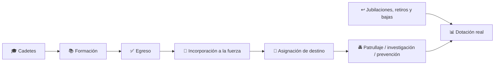
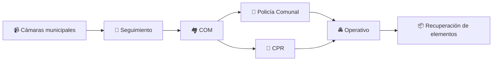

# 👮 Más de 2.000 cadetes juraron a la bandera: qué significa para la seguridad bonaerense y qué puede llegar a nuestra región

La Provincia de Buenos Aires realizó una nueva jura de fidelidad a la bandera de estudiantes de la Policía Bonaerense.

El acto central tuvo lugar el **martes 8 de septiembre** en la **Escuela de Policía Juan Vucetich**, en Berazategui, y estuvo encabezado por el gobernador **Axel Kicillof** y el ministro de Seguridad bonaerense, **Javier Alonso**.

En esa sede participaron **2.075 cadetes**.

Además, medios que reprodujeron la información provincial consignaron que hubo ceremonias simultáneas en **Bahía Blanca, Olavarría, La Costa, Chivilcoy, Mar del Plata y Ramallo**, con otros **598 cadetes**.

Eso lleva el total de participantes de las juras realizadas en la Provincia a aproximadamente:

> **2.075 + 598 = 2.673 futuros policías.**

📌 **Pero hay una aclaración fundamental:** jurar a la bandera **no significa que esos 2.075 agentes ya estén patrullando las calles**.

Los cadetes deben terminar su proceso de formación y, según lo informado, está previsto que se incorporen a la fuerza **hacia fines de 2026**.

👉 [Cobertura de FM Tres Ciudades](https://fmtresciudades.com.ar/2026/09/08/mas-de-2-000-futuros-policias-bonaerenses-juraron-fidelidad-a-la-bandera/)

👉 [Cobertura de Info3407 sobre las ceremonias descentralizadas](https://info3407.com.ar/2026/09/09/kicillof-tomo-juramento-a-2075-cadetes-de-la-policia/)

👉 [Cobertura de Infobae](https://www.infobae.com/politica/2026/09/11/crece-la-presion-politica-sobre-kicillof-por-la-inseguridad-en-pba-y-la-suspension-del-regimen-penal-juvenil/)

---

## 🏋️ También renovaron el polideportivo donde entrenan los futuros agentes

La jornada no consistió únicamente en la ceremonia.

También quedó inaugurada la **puesta en valor del polideportivo de la Escuela Juan Vucetich**, utilizado para el entrenamiento físico y operativo.

Entre las obras informadas aparecen:

- 🔨 recambio de chapas del techo;
- 🌧️ renovación de zinguería;
- ⚡ nueva instalación eléctrica;
- 🚿 construcción de baños y vestuarios;
- 🏃 reacondicionamiento de la cancha;
- 🥋 adaptación del espacio para distintas disciplinas de entrenamiento.

La infraestructura de una escuela policial importa porque la seguridad no depende solamente de **cuántas personas ingresan a una fuerza**, sino también de **cómo se forman y con qué herramientas salen a trabajar**.

👉 [La Voz Regional — detalle de las obras](https://www.lavozregional.com.ar/articulo/mas-de-2.000-cadetes-de-la-policia-bonaerense-juraron-fidelidad-a-la-bandera-nacional.php)

---

## 📊 2.075 en la Vucetich: ¿es mucho o poco?

Mirar solamente la cifra de este año puede resultar engañoso.

Las juras de cadetes variaron durante los últimos años:

| Año | Cadetes informados en la ceremonia principal | Fuente |
|---|---:|---|
| **2024** | 1.848 | Provincia de Buenos Aires |
| **2025** | 2.736 | Provincia de Buenos Aires |
| **2026** | 2.075 en Vucetich + 598 en sedes descentralizadas | Medios que reproducen información provincial |

En otras palabras, **la formación de nuevos policías no comenzó este año ni sigue una cifra fija**.

El dato de 2026 debe analizarse además junto con las sedes descentralizadas: contar únicamente los 2.075 presentes en Berazategui deja afuera a casi 600 cadetes que realizaron la jura en otros puntos de la provincia.

👉 [Provincia — jura de 1.848 cadetes en 2024](https://www.gba.gob.ar/comunicacion_publica/gacetillas/m%C3%A1s_de_1800_cadetes_y_futuros_oficiales_de_la_polic%C3%ADa_provincial_0)

👉 [Provincia — jura de 2.736 cadetes en 2025](https://www.gba.gob.ar/node/50066)

---

## 🚔 ¿Cuántos policías tiene hoy la Provincia?

Las coberturas del acto indican que la Policía Bonaerense cuenta actualmente con **más de 90.000 efectivos**.

Por eso, aun cuando los nuevos egresados representan una incorporación significativa, **2.673 cadetes equivalen a menos del 3% de una fuerza de ese tamaño**.

Y tampoco todo ingreso representa automáticamente un aumento neto equivalente: al mismo tiempo existen jubilaciones, retiros, bajas, licencias y movimientos internos.

Por eso **“2.000 juraron” no es lo mismo que “2.000 policías nuevos ya están en la calle”**.

---

## 🌾 ¿Y qué significa esto para General Las Heras y Villars?

Esta es la pregunta que más importa a nivel local.

Una jura realizada en Berazategui **no garantiza por sí sola cuántos de esos egresados serán destinados a General Las Heras, Villars o la zona rural**.

Las asignaciones posteriores dependen del Ministerio de Seguridad bonaerense y de las necesidades operativas.

Pero durante 2026 sí hubo medidas concretas en nuestro distrito.

### 🚜 El Comando de Prevención Rural aumentó su dotación un 40%

En marzo, el Municipio de General Las Heras informó la incorporación de nuevos agentes al **Comando de Prevención Rural (CPR)**.

Según la comunicación oficial:

- 👮 aumentó un **40% la cantidad de efectivos activos** del CPR;
- 🚓 permitió sumar **un móvil más** al patrullaje rural;
- 🤝 la incorporación fue gestionada entre Municipio y Ministerio de Seguridad bonaerense.

Para un distrito con una extensión rural importante, esto tiene un impacto diferente al de sumar personal exclusivamente en el casco urbano.

👉 [Municipalidad de General Las Heras — incorporación al CPR](https://gobiernodelasheras.com/noticias/mas-efectivos-policiales-para-nuestro-pueblo/)

👉 [Las Heras Noticias — refuerzo del patrullaje rural](https://www.lasherasnoticias.com/refuerzan-el-patrullaje-rural-se-incorporaron-nuevos-agentes-al-cpr-de-general-las-heras/)

---

## 📹 Villars y Plomer sumaron un anillo digital de seguridad

En agosto se puso en funcionamiento una herramienta que toca directamente a nuestra zona: un **anillo digital de seguridad en los accesos a Villars y Plomer**.

El sistema fue desarrollado mediante trabajo conjunto entre:

- 🏘️ General Las Heras;
- 🏘️ Marcos Paz;
- 🟦 Ministerio de Seguridad de la Provincia.

Las cámaras pueden ser utilizadas por los centros de monitoreo de ambos municipios para coordinar respuestas en una zona donde los límites administrativos muchas veces quedan a pocos minutos de distancia.

👉 [Municipio de Marcos Paz — anillo digital de seguridad](https://www.marcospaz-gov-ar.marcospaz.net/noticias/item/10964-marcos-paz-y-las-heras-presentaron-un-anillo-digital-de-seguridad-para-fortalecer-el-control-en-los-accesos-compartidos.html)

👉 [Hora de Informarse — cámaras en Villars y Plomer](https://www.horadeinformarse.com.ar/2026/08/06/marcos-paz-y-general-las-heras-incorporaron-un-anillo-digital-de-seguridad-en-los-accesos-a-plomer-y-villars/)

---

## 🔎 La tecnología ya tuvo utilidad concreta en Villars

El 26 de agosto, luego de dos robos ocurridos en Villars —uno de ellos en el **Deportivo Ferroviario Unión**—, un operativo conjunto entre el CPR, la Policía Comunal y el Centro de Operaciones Municipal permitió detener a uno de los sospechosos y recuperar los elementos denunciados como robados.

Según la información policial difundida por medios locales, el análisis de cámaras municipales fue una parte central de la investigación.

👉 [Las Heras Noticias — operativo por robos en Villars](https://www.lasherasnoticias.com/detuvieron-a-uno-de-los-presuntos-responsables-de-los-robos-en-villars-y-recuperaron-todos-los-elementos-sustraidos/)

Este antecedente permite mostrar algo concreto:

Más agentes pueden ser útiles, pero **la coordinación entre personal, móviles, cámaras, investigación y Justicia es lo que convierte recursos en una respuesta concreta**.

---

## 🏘️ También se proyectó reforzar Hornos

En julio, autoridades municipales y provinciales analizaron la instalación de un **puesto policial en Hornos**, otra de las localidades del distrito.

La iniciativa surgió de reuniones entre el Municipio y la Superintendencia de Seguridad de la Región AMBA Oeste II.

👉 [Las Heras Noticias — proyecto de puesto policial en Hornos](https://www.lasherasnoticias.com/juan-manuel-cerezo-recibio-al-nuevo-superintendente-de-seguridad-del-amba-oeste-ii/)

Al cierre de esta nota encontramos información sobre el **avance del proyecto**, pero no una confirmación oficial de que el puesto ya se encuentre inaugurado y operativo.

---

# 🏛️ Provincia y Nación: detrás del acto también existe una disputa por los recursos

Durante la ceremonia, Kicillof sostuvo que la Provincia mantiene inversión en seguridad pese al ajuste nacional y volvió a reclamar recursos que considera adeudados.

La discusión existe, pero conviene separar **lo comprobable de las afirmaciones políticas de cada gobierno**.

### ✅ Lo comprobable

En febrero de 2024, el Gobierno Nacional dictó el **Decreto 192/2024**, que eliminó el **Fondo de Fortalecimiento Fiscal de la Provincia de Buenos Aires** creado en 2020.

El propio decreto nacional señala como fundamento la necesidad de realizar un ajuste fiscal y sostiene que el fondo quitaba al Estado nacional recursos que necesitaba para ordenar sus cuentas.

👉 [Decreto nacional 192/2024 — texto oficial](https://www.argentina.gob.ar/normativa/nacional/decreto-192-2024-396860/texto)

### 🟦 Qué sostiene la Provincia

El Gobierno bonaerense argumenta que la eliminación y otras transferencias interrumpidas afectaron recursos que utilizaba para políticas públicas, incluida seguridad, y llevó el reclamo por distintas vías administrativas y judiciales.

En el acto de los cadetes, Kicillof calificó la quita como **ilegal**. Esa calificación corresponde a la posición del Gobierno bonaerense y **no debe confundirse con una sentencia judicial definitiva que Villars Informa haya verificado**.

### 🇦🇷 Qué sostuvo Nación al eliminar el fondo

El Decreto 192/2024 justificó la decisión en la emergencia fiscal y afirmó que las transferencias discrecionales habían restringido las finanzas nacionales.

También hay una precisión importante: el texto que creó el Fondo de Fortalecimiento Fiscal establecía como objetivo general **contribuir al normal funcionamiento de las finanzas bonaerenses**. No lo definía jurídicamente como un fondo exclusivamente policial.

Por eso, cuando dirigentes provinciales lo describen como un recurso que permitió financiar patrulleros, equipamiento o salarios, corresponde presentarlo como **el uso y la interpretación defendidos por la Provincia**, no como la descripción literal del objeto legal del fondo.

---

## 💰 ¿Cuánto destina la Provincia a seguridad?

En la presentación del Presupuesto 2026, el Poder Ejecutivo bonaerense informó una previsión de **$1,4 billones** para fortalecer a la Policía y al Sistema Penitenciario.

Ese número fue presentado por el Gobierno provincial como parte de su planificación presupuestaria.

👉 [Provincia — presentación del Presupuesto 2026](https://gba.gob.ar/comunicacion_publica/gacetillas/kicillof_present%C3%B3_los_proyectos_de_leyes_de_presupuesto_impositiva_y)

Pero inversión no significa automáticamente resultados.

Para evaluar una política de seguridad también hay que mirar:

- 📉 evolución de delitos;
- ⏱️ tiempo de respuesta;
- 🚓 cantidad de móviles realmente operativos;
- 👮 agentes efectivamente disponibles por turno;
- 🌾 cobertura rural;
- 📹 funcionamiento de cámaras y comunicaciones;
- ⚖️ coordinación con fiscalías y Justicia;
- 🧑‍🏫 calidad de la formación;
- 🧠 condiciones laborales y salud mental del personal.

---

## 💵 Más agentes también significa discutir cómo trabajan y cuánto cobran

La Provincia otorgó a las fuerzas de seguridad un aumento salarial del **7% durante julio y agosto de 2026**, dividido en un 5% y un 2%, además de anunciar un incremento del 30% en asignaciones familiares.

👉 [Provincia — aumento salarial para las fuerzas de seguridad](https://www.gba.gob.ar/node/53762)

Sin embargo, durante el año también aparecieron reclamos de policías, retirados y familiares vinculados con salarios, endeudamiento, jornadas laborales y atención psicológica.

Esos planteos fueron difundidos por medios de líneas editoriales muy diferentes y deben tomarse como **reclamos de sectores de la fuerza**, no como cifras oficiales automáticamente comprobadas.

👉 [Radio Mitre — reclamos de policías y familiares, febrero de 2026](https://radiomitre.cienradios.com/policiales/policias-bonaerenses-reclaman-en-la-plata-el-sueldo-es-una-miseria-no-tenemos-social-ni-atencion-psicologica-y-ya-tenemos-cinco-suicidios-este-ano/)

👉 [Infomiba — debate sobre salarios y condiciones dentro de la fuerza](https://infomiba.com.ar/nota/58245/kicillof-respaldo-a-la-policia-en-medio-de-una-crisis-por-salarios-y-bajas/)

Esto importa porque **formar nuevos efectivos mientras se deterioran las condiciones del personal existente sería una solución incompleta**.

Una política de seguridad sostenible necesita incorporar gente, pero también retener personal capacitado, equiparlo, supervisarlo y garantizar condiciones profesionales de trabajo.

---

## ⚖️ También hay críticas políticas a la gestión bonaerense

La jura ocurrió mientras dirigentes opositores reclamaban explicaciones al ministro Javier Alonso por la situación de inseguridad provincial.

Infobae informó que sectores de **La Libertad Avanza** buscaban llevar al ministro a la Legislatura bonaerense para responder preguntas sobre la política de seguridad.

👉 [Infobae — debate político sobre seguridad bonaerense](https://www.infobae.com/politica/2026/09/11/crece-la-presion-politica-sobre-kicillof-por-la-inseguridad-en-pba-y-la-suspension-del-regimen-penal-juvenil/)

Es un dato relevante porque muestra los dos planos que conviven detrás del acto:

- el Ejecutivo exhibe incorporación, equipamiento y formación;
- la oposición cuestiona resultados y reclama explicaciones;
- los vecinos necesitan evaluar ambas cosas con indicadores concretos.

**Más policías es un recurso. La pregunta posterior es qué resultados produce ese recurso.**

---

## 🧭 ¿Quién hace qué en seguridad?

| Nivel | Responsabilidad / intervención |
|---|---|
| 🇦🇷 **Nación** | Fuerzas federales, delitos federales, políticas nacionales y transferencias interjurisdiccionales. |
| 🟦 **Provincia de Buenos Aires** | Policía Bonaerense, formación policial, destinos, patrulleros, comisarías, CPR y política de seguridad provincial. |
| 🏘️ **Municipio** | Cámaras, COM, Guardia Urbana cuando existe, prevención local, iluminación y coordinación territorial con la Policía provincial. |
| ⚖️ **Poder Judicial / Ministerio Público** | Investigación penal, órdenes judiciales y decisiones procesales. |

Para Villars esto se ve con bastante claridad: el **CPR y la Policía Comunal pertenecen a la estructura provincial**, mientras el **Centro de Operaciones Municipal y las cámaras** son herramientas locales que se integran al trabajo policial.

---

## 🌾 Para la gente del campo, la cantidad no alcanza si los kilómetros quedan sin cubrir

En una ciudad compacta, una patrulla puede recorrer varias cuadras en minutos.

En el campo la ecuación cambia.

Una misma dotación puede tener que cubrir:

- caminos rurales;
- establecimientos separados por kilómetros;
- accesos a Villars, Hornos, Plomer y La Choza;
- tramos de rutas provinciales;
- escuelas rurales;
- zonas de producción;
- denuncias por abigeato o caza ilegal.

Por eso el dato local del **40% de aumento en el CPR** y la incorporación de un móvil adicional puede tener más impacto territorial que una cifra provincial enorme que todavía no tiene destinos asignados.

---

## 📌 Entonces, ¿qué cambia realmente después de esta jura?

### Ahora

✅ 2.075 cadetes de la Vucetich realizaron la jura.  
✅ Otros 598 participaron en sedes descentralizadas.  
✅ El polideportivo de la escuela fue renovado.  
✅ Los cadetes continúan su formación.

### Hacia fin de año

⏳ Deberán completar sus estudios.  
⏳ Quienes egresen podrán incorporarse a la Policía Bonaerense.  
⏳ Se definirán destinos y distribución territorial.

### Para nuestra región

❓ Todavía no hay una cifra pública que indique cuántos de esos nuevos agentes irán a General Las Heras, Villars o distritos cercanos.

📌 **Ese será el dato que Villars Informa deberá seguir.**

---

## ❤️ Seguridad para el vecino: menos discurso y más resultados medibles

La incorporación de policías, la renovación de una escuela y la compra de móviles son medidas concretas.

También lo son las cámaras que ya funcionan en Villars y Plomer, el refuerzo del CPR de General Las Heras y los operativos coordinados que permitieron recuperar elementos robados.

Pero ninguna administración debería medir la seguridad solamente por **cuántos cadetes juran, cuántos patrulleros se muestran o cuántas cámaras se inauguran**.

Lo que finalmente importa para una familia es más sencillo:

> **¿Puede vivir tranquila? ¿Llega una patrulla cuando la necesita? ¿Se investiga un robo? ¿Hay presencia en el campo? ¿Funcionan los móviles? ¿El policía está bien formado y tiene condiciones dignas para trabajar?**

La jura de septiembre suma nuevos recursos para el sistema. La evaluación real llegará cuando esos cadetes egresen, reciban destinos y su presencia pueda medirse en la calle, en los barrios y también en nuestros caminos rurales.

---

## 📚 Fuentes consultadas

- **FM Tres Ciudades** — jura de 2.075 cadetes y obras en la Vucetich, 08/09/2026:  
  https://fmtresciudades.com.ar/2026/09/08/mas-de-2-000-futuros-policias-bonaerenses-juraron-fidelidad-a-la-bandera/

- **Info3407** — 2.075 cadetes en Vucetich y 598 en sedes descentralizadas:  
  https://info3407.com.ar/2026/09/09/kicillof-tomo-juramento-a-2075-cadetes-de-la-policia/

- **La Voz Regional** — obras de puesta en valor del polideportivo:  
  https://www.lavozregional.com.ar/articulo/mas-de-2.000-cadetes-de-la-policia-bonaerense-juraron-fidelidad-a-la-bandera-nacional.php

- **Infobae** — contexto político y cuestionamientos opositores a la política de seguridad:  
  https://www.infobae.com/politica/2026/09/11/crece-la-presion-politica-sobre-kicillof-por-la-inseguridad-en-pba-y-la-suspension-del-regimen-penal-juvenil/

- **Provincia de Buenos Aires** — jura de 1.848 cadetes en 2024:  
  https://www.gba.gob.ar/comunicacion_publica/gacetillas/m%C3%A1s_de_1800_cadetes_y_futuros_oficiales_de_la_polic%C3%ADa_provincial_0

- **Provincia de Buenos Aires** — jura de 2.736 cadetes en 2025:  
  https://www.gba.gob.ar/node/50066

- **Gobierno Nacional** — Decreto 192/2024 que eliminó el Fondo de Fortalecimiento Fiscal bonaerense:  
  https://www.argentina.gob.ar/normativa/nacional/decreto-192-2024-396860/texto

- **Provincia de Buenos Aires** — presentación de las previsiones de inversión del Presupuesto 2026:  
  https://gba.gob.ar/comunicacion_publica/gacetillas/kicillof_present%C3%B3_los_proyectos_de_leyes_de_presupuesto_impositiva_y

- **Provincia de Buenos Aires** — aumento salarial del 7% para fuerzas de seguridad, julio-agosto 2026:  
  https://www.gba.gob.ar/node/53762

- **Municipalidad de General Las Heras** — aumento del 40% de la dotación activa del CPR:  
  https://gobiernodelasheras.com/noticias/mas-efectivos-policiales-para-nuestro-pueblo/

- **Las Heras Noticias** — refuerzo policial rural en General Las Heras:  
  https://www.lasherasnoticias.com/refuerzan-el-patrullaje-rural-se-incorporaron-nuevos-agentes-al-cpr-de-general-las-heras/

- **Municipio de Marcos Paz** — anillo digital de seguridad Villars-Plomer:  
  https://www.marcospaz-gov-ar.marcospaz.net/noticias/item/10964-marcos-paz-y-las-heras-presentaron-un-anillo-digital-de-seguridad-para-fortalecer-el-control-en-los-accesos-compartidos.html

- **Hora de Informarse** — sistema de cámaras en Villars y Plomer:  
  https://www.horadeinformarse.com.ar/2026/08/06/marcos-paz-y-general-las-heras-incorporaron-un-anillo-digital-de-seguridad-en-los-accesos-a-plomer-y-villars/

- **Las Heras Noticias** — operativo por robos en Villars, 26/08/2026:  
  https://www.lasherasnoticias.com/detuvieron-a-uno-de-los-presuntos-responsables-de-los-robos-en-villars-y-recuperaron-todos-los-elementos-sustraidos/

- **Las Heras Noticias** — coordinación Provincia-Municipio y proyecto de puesto policial en Hornos:  
  https://www.lasherasnoticias.com/juan-manuel-cerezo-recibio-al-nuevo-superintendente-de-seguridad-del-amba-oeste-ii/

- **Radio Mitre** — reclamos de sectores policiales sobre salarios y condiciones de trabajo:  
  https://radiomitre.cienradios.com/policiales/policias-bonaerenses-reclaman-en-la-plata-el-sueldo-es-una-miseria-no-tenemos-social-ni-atencion-psicologica-y-ya-tenemos-cinco-suicidios-este-ano/

- **Infomiba** — debate sobre salarios, bajas y condiciones dentro de la Policía Bonaerense:  
  https://infomiba.com.ar/nota/58245/kicillof-respaldo-a-la-policia-en-medio-de-una-crisis-por-salarios-y-bajas/

---

**Redacción, investigación y adaptación: Villars Informa.**

Artículo elaborado mediante contraste de documentación oficial nacional y bonaerense, comunicaciones municipales y medios con enfoques editoriales diferentes. **La redacción es propia** y distingue entre hechos verificados, anuncios gubernamentales, reclamos laborales y posiciones políticas.

**Villars Informa** seguirá la distribución de los nuevos egresados para determinar si el refuerzo anunciado a nivel provincial se traduce posteriormente en más personal para General Las Heras, Villars y la zona rural.
