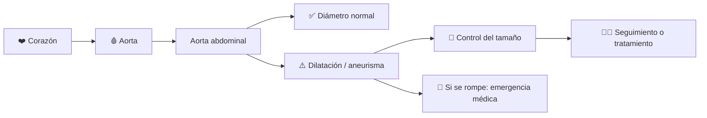
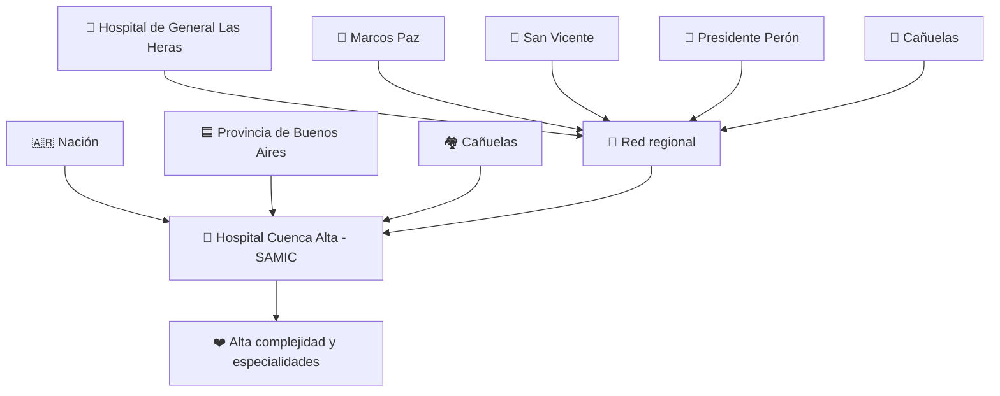

## 🏥 Tres días de controles gratuitos para detectar una enfermedad silenciosa

El **Hospital Cuenca Alta Néstor Kirchner (HCANK)**, ubicado en Cañuelas, finalizó una campaña de detección temprana de **aneurisma de aorta abdominal (AAA)**, una enfermedad que puede avanzar durante años sin producir síntomas y transformarse en una emergencia grave si la arteria se rompe.

La propuesta fue impulsada por el servicio de **Cardiología** del hospital y coordinada por **Rodrigo Sánchez**, médico especializado en cirugía vascular periférica y endovascular.

Durante tres jornadas consecutivas se realizaron **controles rápidos y gratuitos mediante ecografía abdominal** a hombres mayores de 65 años con antecedentes de tabaquismo, el grupo al que estuvo orientada oficialmente esta edición de la campaña.

👉 [Información oficial del Hospital Cuenca Alta](https://www.hospitalcuencaalta.org.ar/index.php/nuestro-hospital/noticias/deteccion-temprana-de-aneurisma-de-aorta-abdominal-en-el-hcank)

👉 [Cobertura previa de La Página Cañuelas](https://lapaginacanuelas.com/canuelas/deteccion-aneurisma-aorta-abdominal-hcank-canuelas-septiembre-2026/)

---

## 🩻 ¿Qué es un aneurisma de aorta abdominal?

La **aorta** es la arteria principal que transporta sangre desde el corazón hacia gran parte del organismo.

Un aneurisma aparece cuando una sección de su pared **se dilata y aumenta de diámetro**. Cuando esto ocurre en la zona del abdomen se denomina **aneurisma de aorta abdominal**.

El problema es que muchos aneurismas **no generan síntomas antes de complicarse**.

El Hospital Cuenca Alta señala que una rotura puede causar una hemorragia interna severa y que la mortalidad supera el **80%**. Esa magnitud coincide con la evidencia revisada por la *US Preventive Services Task Force* (USPSTF), que estima que el riesgo de muerte asociado a un AAA roto puede llegar aproximadamente al **81%**.

👉 [Recomendación clínica de la USPSTF sobre detección de AAA](https://www.uspreventiveservicestaskforce.org/uspstf/recommendation/abdominal-aortic-aneurysm-screening)

---

## 🚬 ¿Por qué se puso el foco en mayores de 65 años que fumaron?

Porque el riesgo no es igual para toda la población.

Entre los factores más importantes aparecen:

- 👴 edad avanzada;
- 🚹 sexo masculino;
- 🚬 tabaquismo actual o pasado;
- 🧬 antecedentes familiares de aneurisma;
- ❤️ distintas enfermedades cardiovasculares.

El Ministerio de Salud de la Nación incluye al **aneurisma de aorta abdominal** entre los daños cardiovasculares asociados al tabaquismo.

👉 [Ministerio de Salud — daños cardiovasculares del tabaco](https://www.argentina.gob.ar/node/262846)

La USPSTF recomienda una ecografía de detección **una vez** para hombres de **65 a 75 años que hayan fumado alguna vez**, mientras que para otros grupos la decisión depende de antecedentes y factores individuales.

📌 Esa recomendación internacional sirve como referencia clínica, pero **no reemplaza la evaluación médica personal ni constituye por sí sola un protocolo argentino obligatorio**.

---

## ⏱️ Un estudio sencillo puede cambiar completamente el escenario

La herramienta utilizada es la **ecografía abdominal**.

No utiliza radiación, es no invasiva y permite observar la aorta y medir su diámetro.

| Sin detección temprana | Con detección temprana |
|---|---|
| 🤫 El aneurisma puede permanecer silencioso | 🩻 Puede descubrirse antes de dar síntomas |
| ❓ Se desconoce su tamaño | 📏 Se puede medir su diámetro |
| 🚨 Puede debutar con una complicación | 👨‍⚕️ Permite definir controles y tratamiento |
| 🏥 La rotura requiere atención urgente | 🛡️ Algunos casos pueden tratarse preventivamente |

El tamaño importa: **el riesgo de rotura aumenta a medida que aumenta el diámetro del aneurisma**, por lo que no todos los hallazgos necesitan la misma conducta.

El HCANK informó que la evaluación permite determinar el seguimiento o tratamiento necesario antes de que exista riesgo de ruptura.

---

## ⚠️ Una precisión importante sobre el tratamiento

El hospital explicó que existen tratamientos **endovasculares**, realizados mediante pequeños accesos en la zona de la ingle y colocación de una prótesis o *stent* dentro de la aorta.

Pero encontrar un aneurisma **no significa automáticamente que haya que operar**.

El manejo depende de factores como:

- tamaño;
- velocidad de crecimiento;
- anatomía;
- síntomas;
- edad y estado general;
- riesgo quirúrgico individual.

Por eso, después de una ecografía positiva, la decisión corresponde al equipo médico que evalúa cada caso.

---

## 🌾 ¿Por qué esta noticia importa en General Las Heras y Villars?

Porque el Cuenca Alta no funciona únicamente para Cañuelas.

El hospital integra una red sanitaria regional que alcanza inicialmente a **cinco municipios**:

- Cañuelas;
- **General Las Heras**;
- Marcos Paz;
- San Vicente;
- Presidente Perón.

Según la información institucional del HCANK, su área de influencia comprende aproximadamente **400.000 habitantes**.

👉 [Red asistencial del Hospital Cuenca Alta](https://www.hospitalcuencaalta.org.ar/index.php/nuestro-hospital/nuestra-red)

Para General Las Heras, el hospital de referencia dentro de esa red es el **Hospital Municipal Dr. Pedro Arazarena**.

En el funcionamiento habitual del HCANK, los pacientes ingresan a la alta complejidad mediante **derivación de los hospitales de la red**, aunque determinadas campañas abiertas pueden establecer modalidades especiales.

Esto es particularmente relevante para la población rural: muchas especialidades y estudios de mayor complejidad **no se encuentran disponibles en cada pueblo**, por lo que una red sanitaria coordinada permite que la atención local tenga un centro regional al cual derivar.

---

## 📍 La campaña terminó: ¿qué hace ahora alguien que tiene factores de riesgo?

El propio Hospital Cuenca Alta dejó una recomendación para quienes **no llegaron a participar**.

> Quienes tengan factores de riesgo pueden consultar con su médico de cabecera sobre la indicación de realizar una **ecografía de aorta abdominal**.

Es importante remarcarlo porque la convocatoria gratuita de septiembre **no debe publicarse como si todavía estuviera abierta**.

### 📞 Hospital Cuenca Alta Néstor Kirchner

- **Teléfono:** 11 5273-4700
- **Central interactiva / WhatsApp informado por el hospital:** (2226) 557446
- **Ubicación:** Ruta Provincial 6 km 92,5, Cañuelas
- 🚆 Tren Roca: estación **Hospital Cuenca Alta Néstor Kirchner**

👉 [Cómo acceder a la atención del HCANK](https://www.hospitalcuencaalta.org.ar/index.php/informacion/como-acceder-a-la-atencion)

---

## 🏛️ Nación, Provincia y municipio: en este hospital la salud pública es compartida

En este caso hay un dato que conviene explicar antes de atribuir la campaña a un solo gobierno.

El Cuenca Alta es un hospital **S.A.M.I.C. —Servicio de Atención Médica Integral para la Comunidad—**, con una estructura de gestión compartida.

Su Consejo de Administración publicado actualmente está compuesto por representantes de:

| Representación | Integrantes publicados por el HCANK |
|---|---:|
| 🇦🇷 Ministerio de Salud de la Nación | **2** |
| 🟦 Ministerio de Salud de la Provincia de Buenos Aires | **2** |
| 🏘️ Municipio de Cañuelas | **1** |

👉 [Autoridades actuales del Hospital Cuenca Alta](https://www.hospitalcuencaalta.org.ar/index.php/nuestro-hospital/autoridades)

Por eso esta campaña es un buen ejemplo de algo que muchas veces se pierde en la discusión política: **una prestación pública concreta puede depender de más de un nivel del Estado al mismo tiempo**.

La administración nacional informó en 2025 que mantenía participación en el hospital y designó representantes nacionales en su Consejo. A su vez, la estructura oficial actual del HCANK incluye representantes bonaerenses y municipales.

👉 [Ministerio de Salud de la Nación — autoridades del Cuenca Alta](https://www.argentina.gob.ar/noticias/el-ministro-lugones-recibio-las-nuevas-autoridades-del-hospital-cuenca-alta)

---

## 💰 Prevención gratuita: por qué importa para el bolsillo

Hay una diferencia importante entre **saber que un estudio existe** y poder acceder a él.

Para una persona jubilada, un trabajador rural o una familia que vive lejos de los grandes centros urbanos, un control puede implicar:

- 🚗 traslado;
- ⛽ combustible;
- 🚌 pasajes;
- ⏰ horas fuera del trabajo;
- 👨‍⚕️ consulta;
- 🩻 estudio;
- 🏥 eventuales controles posteriores.

Una campaña gratuita y concentrada en un grupo de mayor riesgo **reduce al menos algunas de esas barreras**, especialmente el costo directo del estudio y la necesidad de atravesar circuitos más largos para un primer control.

Al mismo tiempo, una campaña de tres días **no sustituye una política permanente de acceso**. Para que la prevención tenga continuidad, quienes quedaron afuera necesitan saber dónde consultar, cómo obtener la derivación y qué seguimiento corresponde si aparece un hallazgo.

Ahí cobran importancia tanto el hospital regional como **el hospital municipal y la atención primaria local**.

---

## 🚭 Detectar temprano es una parte; reducir el riesgo es otra

El tabaquismo es uno de los factores de riesgo modificables más importantes.

Actualmente sigue vigente el servicio gratuito nacional de ayuda para dejar la nicotina:

☎️ **0800-999-3040**

La normativa nacional actualizada en 2026 mantiene ese número y el acceso al servicio del Ministerio de Salud.

👉 [Programa y normativa nacional sobre consumo de tabaco y nicotina](https://www.argentina.gob.ar/normativa/nacional/norma-196534/actualizacion)

Esto tampoco significa que abandonar el tabaco elimine inmediatamente todos los riesgos acumulados, pero dejar de fumar **reduce progresivamente el riesgo cardiovascular** y genera beneficios sanitarios importantes.

---

<strong>🩺 ¿Qué síntomas pueden aparecer si un aneurisma se complica?</strong>

Muchos aneurismas no dan síntomas. Cuando aparecen manifestaciones, especialmente si son **repentinas o intensas**, requieren evaluación médica.

Un aneurisma roto puede producir una emergencia con dolor intenso y deterioro rápido del estado general.

🚨 **Ante síntomas graves o una emergencia, no esperar una campaña preventiva ni gestionar un turno común: corresponde solicitar atención de urgencia.**

Esta nota es informativa y no reemplaza una evaluación médica.

---

## 🔎 Lo confirmado y lo que no debemos exagerar

### ✅ Confirmado

- La campaña fue realizada por el **Hospital Cuenca Alta Néstor Kirchner**.
- Se desarrolló durante **tres jornadas consecutivas**.
- Las convocatorias locales la ubicaron entre el **14 y el 16 de septiembre de 2026**.
- El control se realizó mediante **ecografía abdominal**.
- Fue **gratuito**.
- La página oficial del HCANK señala como población objetivo a **hombres mayores de 65 años con antecedentes de tabaquismo**.
- El hospital forma parte de una red que incluye a **General Las Heras**.
- Quienes no participaron deben consultar a su médico sobre si corresponde realizar el estudio.

### ⚠️ No informado públicamente en la nota oficial consultada

- Cantidad total de personas estudiadas.
- Cuántos aneurismas fueron detectados.
- Cuántos pacientes necesitaron seguimiento.
- Cuántos necesitaron tratamiento.
- Costo total de la campaña.
- Si habrá una nueva edición y en qué fecha.

📌 Si esos datos aparecen posteriormente, permitirán evaluar no sólo la convocatoria sino también **el alcance concreto de la campaña**.

---

## ❤️ Prevenir antes de llegar a una guardia

La importancia de esta campaña no está en una ceremonia ni en una fotografía institucional.

Está en algo mucho más simple: **buscar una enfermedad antes de que dé la cara de la peor manera**.

Para un vecino de más de 65 años que fumó durante parte de su vida, una ecografía de pocos minutos puede detectar una dilatación que todavía no provoca molestias y darle al equipo médico la oportunidad de controlarla antes de una emergencia.

Y para localidades como **Villars y General Las Heras**, también deja otra enseñanza: la salud de alta complejidad no puede pensarse aislada de los hospitales municipales, el transporte, las derivaciones y la prevención.

> 🫀 **Una salud pública que llega antes de la emergencia no sólo atiende enfermedades: puede evitar que una enfermedad silenciosa se convierta en tragedia.**

---

## 📚 Fuentes consultadas

- **Hospital Cuenca Alta Néstor Kirchner** — *Detección Temprana de Aneurisma de Aorta Abdominal en el HCANK*:  
  https://www.hospitalcuencaalta.org.ar/index.php/nuestro-hospital/noticias/deteccion-temprana-de-aneurisma-de-aorta-abdominal-en-el-hcank

- **Hospital Cuenca Alta Néstor Kirchner** — Red regional y hospitales integrantes:  
  https://www.hospitalcuencaalta.org.ar/index.php/nuestro-hospital/nuestra-red

- **Hospital Cuenca Alta Néstor Kirchner** — Cómo acceder a la atención:  
  https://www.hospitalcuencaalta.org.ar/index.php/informacion/como-acceder-a-la-atencion

- **Hospital Cuenca Alta Néstor Kirchner** — Consejo de Administración y autoridades actuales:  
  https://www.hospitalcuencaalta.org.ar/index.php/nuestro-hospital/autoridades

- **La Página Cañuelas** — convocatoria gratuita del 14 al 16 de septiembre de 2026:  
  https://lapaginacanuelas.com/canuelas/deteccion-aneurisma-aorta-abdominal-hcank-canuelas-septiembre-2026/

- **El Ciudadano de Cañuelas** — cobertura de la campaña preventiva, 15/09/2026:  
  https://elciudadano.com.ar/contenido/23674/salud-cardiovascular-en-el-hcank-realizan-ecografias-gratuitas-de-dos-minutos-pa

- **Ministerio de Salud de la Nación** — daños cardiovasculares vinculados al tabaquismo:  
  https://www.argentina.gob.ar/node/262846

- **Ministerio de Salud de la Nación** — normativa actualizada y servicio gratuito para dejar la nicotina:  
  https://www.argentina.gob.ar/normativa/nacional/norma-196534/actualizacion

- **Ministerio de Salud de la Nación** — información institucional sobre autoridades del HCANK:  
  https://www.argentina.gob.ar/noticias/el-ministro-lugones-recibio-las-nuevas-autoridades-del-hospital-cuenca-alta

- **U.S. Preventive Services Task Force (USPSTF)** — evidencia y recomendaciones sobre detección de aneurisma de aorta abdominal:  
  https://www.uspreventiveservicestaskforce.org/uspstf/recommendation/abdominal-aortic-aneurysm-screening

---

**Redacción, investigación y adaptación: Villars Informa.**

Artículo elaborado mediante contraste de la información oficial del Hospital Cuenca Alta con medios locales, documentación sanitaria oficial y evidencia clínica sobre detección del aneurisma de aorta abdominal. **La redacción es propia** y agrega contexto útil para General Las Heras, Villars y la comunidad regional.

**Información sanitaria:** este contenido tiene fines informativos y no sustituye el diagnóstico, la indicación de estudios ni el tratamiento realizado por profesionales de la salud.

<SocialEmbed url="https://www.facebook.com/100063769501994/videos/pcb.1696179829184318/1005689595815238" />
