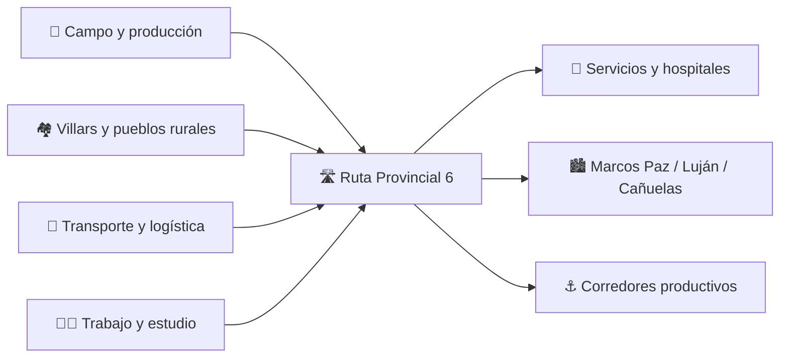

## 🚚 Un camión terminó dentro de un arroyo sobre la Ruta 6

Un camión que transportaba cemento **se despistó de la Ruta Provincial 6 y terminó dentro de un arroyo** durante la mañana del miércoles **2 de septiembre de 2026**.

El episodio ocurrió pasadas las **6:30**, a la altura del **kilómetro 129**, sobre la mano que circula en sentido hacia **Luján**.

De acuerdo con la información publicada por *Las Heras Noticias*, el conductor perdió el control del transporte por motivos que todavía debían determinarse. Pese a la magnitud del despiste, **no se informaron personas con heridas de gravedad**.

En el operativo trabajaron **Bomberos Voluntarios de Villars y de Marcos Paz**, que realizaron tareas de asistencia y seguridad en el lugar.

👉 [Leer la información original de Las Heras Noticias](https://www.lasherasnoticias.com/un-camion-se-despisto-en-la-ruta-6-y-termino-dentro-de-un-arroyo/)

---

## 📍 ¿Dónde ocurrió?

El kilómetro 129 se encuentra en el corredor que une la zona de **Villars, Plomer, Marcos Paz y General Rodríguez**.

Es una parte particularmente importante de la Ruta 6 para quienes viven o trabajan en áreas rurales: por allí circulan **camiones, trabajadores, productores, transporte de mercadería y vecinos que necesitan conectarse con Luján, Cañuelas, Marcos Paz y otras localidades de la región**.

La propia Provincia define a la Ruta 6 como un corredor estratégico para la producción y la logística bonaerense, con tramos que reciben entre **6.000 y 35.000 vehículos diarios**, según la zona.

👉 [Provincia de Buenos Aires: intervención integral de la Ruta 6](https://gba.gob.ar/infraestructura/noticias/avanza_la_intervenci%C3%B3n_integral_de_la_ruta_6)

---

## ⚠️ No fue un hecho aislado: varios siniestros fueron reportados en pocos días

El caso del camión no permite, por sí solo, concluir que exista una única causa común detrás de los accidentes. Sin embargo, al revisar los medios locales aparece una **concentración llamativa de hechos recientes en un tramo relativamente cercano**.

| Fecha | Zona | Hecho informado | Consecuencias conocidas |
|---|---|---|---|
| **26/08/2026** | km 121 | Un automóvil despistó y volcó | El conductor sufrió golpes y rechazó traslado |
| **28/08/2026** | km 123,5 | Choque entre una camioneta y un camión | Camionero ileso; se inició la búsqueda del otro conductor |
| **31/08/2026** | Ruta 6, zona Las Heras/Marcos Paz | Cereal derramado sobre la calzada; motos cayeron y otros vehículos despistaron | Al menos dos motociclistas trasladados al Hospital de Las Heras |
| **02/09/2026** | km 129 | Camión con cemento despistó y terminó en un arroyo | Sin heridos de gravedad informados |

📌 **Cuatro hechos reportados entre el 26 de agosto y el 2 de septiembre.**

Eso **no prueba que la infraestructura haya causado todos los siniestros**: en varios casos las causas continuaban bajo investigación. Sí justifica que quienes utilizan diariamente el corredor presten especial atención y que las autoridades mantengan controles, señalización, mantenimiento y respuesta de emergencia adecuados.

Fuentes:

- [Vuelco en km 121 — Las Heras Noticias](https://www.lasherasnoticias.com/vuelco-en-la-ruta-6/)
- [Choque en km 123,5 — Hora de Informarse](https://www.horadeinformarse.com.ar/2026/08/28/accidente-en-la-ruta-6-buscan-al-conductor-de-una-camioneta-que-se-retiro-caminando-del-lugar/)
- [Siniestro múltiple del 31 de agosto — Las Heras Noticias](https://www.lasherasnoticias.com/accidente-multiple-en-la-ruta-6-al-menos-dos-motociclistas-fueron-trasladados-al-hospital-de-las-heras/)

<strong>🗓️ Otros antecedentes de 2026 cerca de Villars</strong>

En marzo, *Hora de Informarse* reportó que un automóvil se despistó en el **puente de Villars** y terminó entre los arbustos. Ese medio señaló que el sector donde ocurrió el hecho no tenía guardarraíl.

En junio, *Las Heras Noticias* informó el vuelco de otro camión en el **kilómetro 125**, también en sentido Cañuelas–Luján. El conductor fue trasladado al hospital y fueron necesarias tres grúas para retirar el transporte.

Estos antecedentes sirven para dimensionar la cantidad de intervenciones de los equipos de emergencia en la zona, pero no deben interpretarse como prueba de que todos los accidentes tengan la misma causa.

- [Despiste en el puente de Villars — 12/03/2026](https://www.horadeinformarse.com.ar/2026/03/12/despiste-en-la-ruta-6-un-auto-se-cayo-del-puente-de-villars/)
- [Vuelco de camión en km 125 — 13/06/2026](https://www.lasherasnoticias.com/volco-un-camion-en-la-ruta-6-y-el-conductor-fue-trasladado-al-hospital/)

---

## 🛣️ ¿Quién es responsable de la Ruta 6?

Acá conviene separar responsabilidades para no echar culpas donde no corresponde.

| Nivel / organismo | Rol sobre este corredor |
|---|---|
| 🟦 **Provincia de Buenos Aires** | Es una **ruta provincial**. El Ministerio de Infraestructura y la Dirección de Vialidad bonaerense intervienen en planificación, obras y control. |
| 🛣️ **AUBASA** | Tiene concesionada la Ruta 6 para su operación, conservación, mejora y mantenimiento. Es una empresa de capital público bonaerense. |
| 🏘️ **Municipios** | Participan en prevención local, seguridad, tránsito, coordinación territorial y apoyo a emergencias, especialmente en accesos y zonas urbanas. |
| 🇦🇷 **Nación** | No es el operador directo de esta Ruta Provincial 6. Las responsabilidades concretas de mantenimiento y explotación de este corredor corresponden al ámbito bonaerense y a su concesionaria. |

La documentación de AUBASA establece que la concesión comprende la **operación, conservación, mejora y mantenimiento** de la traza de la Ruta Provincial 6.

👉 [Documentación legal de AUBASA — concesión de Ruta 6](https://aubasa.com.ar/legales/)

---

## 🏗️ ¿Qué está haciendo la Provincia en la Ruta 6?

La Provincia mantiene en ejecución un programa de **intervención integral de la Ruta 6**.

Las obras informadas oficialmente incluyen:

- 🛣️ repavimentación y rehabilitación de calzadas;
- 🌉 mantenimiento de **16 puentes viales y 12 hidráulicos**;
- 💧 mejoras de alcantarillas y escurrimiento;
- 🚧 señalización vertical y horizontal;
- 💡 recambio de luminarias;
- 🛡️ instalación de barandas de defensa;
- 🚑 incorporación o mejora de servicios de asistencia vial.

En septiembre de 2025, el Gobierno bonaerense informó que se habían finalizado **97 kilómetros de los 140 kilómetros** contemplados en una de las intervenciones integrales.

Durante 2026 continuaron las obras. La actualización más reciente encontrada, del **17 de septiembre de 2026**, informa trabajos en **Exaltación de la Cruz, Pilar y Campana**.

👉 [Vialidad bonaerense — actualización del 17/09/2026](https://www.vialidad.gba.gob.ar/noticiadvba.php?id_noticia=2570&pagina=link_noticia)

👉 [Provincia — avance de 97 km sobre 140 km informado en 2025](https://www.gba.gob.ar/infraestructura/noticias/avanza_el_mejoramiento_integral_de_la_rp_6)

### 🔍 ¿Y específicamente en el km 129?

Acá hay que ser precisos: **no encontramos una actualización oficial que detalle el estado puntual del kilómetro 129 al día del accidente**.

Por eso, Villars Informa **no atribuye el despiste al pavimento, a una banquina, a una defensa faltante ni a otro elemento de infraestructura** sin una pericia o informe oficial que lo respalde.

Lo que sí puede verificarse es que el tramo comprendido entre la RP 40 y la RP 24 —que atraviesa General Las Heras, Marcos Paz y General Rodríguez— fue incluido desde el inicio dentro del esquema de intervención integral de la Ruta 6.

---

## 🏘️ ¿Qué hacen los municipios y los servicios locales?

Para una familia o un trabajador rural, la seguridad vial no termina en quién repavimenta: también importa **quién llega cuando pasa algo**.

En este accidente intervinieron **Bomberos Voluntarios de Villars y Marcos Paz**.

Además, durante 2026 el Municipio de Marcos Paz informó acciones coordinadas con General Las Heras para ampliar un **anillo digital de seguridad sobre la Ruta 6 en los accesos a Plomer y Villars**.

La Secretaría de Seguridad de Marcos Paz también señaló en septiembre que evaluaba **reforzar personal y operativos sobre las rutas 6 y 40** ante el incremento de circulación.

👉 [Marcos Paz — coordinación en accesos a Plomer y Villars](https://app.marcospazconectada.com/2026/07/27/el-intendente-informo-sobre-temas-de-gestion/)

👉 [Informe de Seguridad de Marcos Paz — 03/09/2026](https://noticias.marcospazconectada.com/2026/09/03/informe-de-seguridad-18/)

---

## 💸 También habrá peajes: seguridad, mantenimiento y bolsillo deben ir juntos

Otro dato importante para quienes utilizan la Ruta 6 para **ir a trabajar, transportar producción o moverse entre pueblos** es que durante 2026 la Provincia avanzó con el esquema de peajes de AUBASA sobre este corredor.

La concesión de la Ruta 6 existe desde 2016 y en 2026 se aprobó un cuadro tarifario para **tres puntos de cobro**, con la previsión informada por distintos medios de que el cobro efectivo comenzaría hacia fines de año mediante un sistema *Free Flow*.

👉 [AUBASA — documentación de la concesión](https://aubasa.com.ar/legales/)

👉 [Estación Vial — esquema de peajes aprobado en 2026](https://estacionvial.com.ar/nota/3594/la-provincia-aprobo-el-cobro-de-peaje-en-la-ruta-6-con-actualizacion-trimestral/)

Para quienes dependen de esta ruta todos los días, el debate no debería reducirse a **“peaje sí o peaje no”**. También importa poder controlar qué servicios recibe la comunidad a cambio: estado de la calzada, defensas, iluminación, señalización, grúas, ambulancias y tiempos de respuesta.

La seguridad vial también es una cuestión de bolsillo: **un trabajador no sólo necesita poder pagar el viaje; necesita llegar a destino sano y a horario**.

---

## 🧭 La Ruta 6 es una ruta productiva, pero también es la ruta cotidiana de nuestros pueblos

La Ruta Provincial 6 conecta polos industriales y portuarios, pero para **Villars, Plomer, General Las Heras, Marcos Paz y las áreas rurales cercanas** es mucho más que un corredor logístico.

Por ella circulan:

- 🚚 trabajadores del transporte;
- 🚜 productores y proveedores rurales;
- 🧑‍🏭 trabajadores de industrias y comercios;
- 🎒 estudiantes;
- 🏥 personas que necesitan acceder a hospitales y servicios;
- 🏡 familias que viven lejos de los centros urbanos.

Por eso, mejorar la seguridad de la Ruta 6 no beneficia únicamente a las grandes cargas o al comercio: **impacta directamente en la vida cotidiana de la comunidad**.

---

## 🚨 Qué sabemos y qué todavía no sabemos

### ✅ Confirmado

- El hecho ocurrió el **2 de septiembre de 2026**.
- Fue alrededor de las **6:30**.
- Sucedió a la altura del **km 129** de la Ruta 6.
- El camión transportaba **cemento**.
- Circulaba en sentido hacia **Luján**.
- Terminó en un arroyo al costado de la ruta.
- No se reportaron heridas de gravedad.
- Intervinieron Bomberos de **Villars y Marcos Paz**.

### ❓ No confirmado públicamente

- La causa exacta del despiste.
- Si existió una falla mecánica.
- Si hubo una maniobra de otro vehículo.
- Si las condiciones de la calzada influyeron.
- Si hubo factores climáticos determinantes.
- El resultado de eventuales peritajes posteriores.

Ese límite es importante: **informar también significa saber decir cuándo todavía no hay datos suficientes**.

---

## ❤️ Una respuesta que se repite: nuestros Bomberos

Detrás de varios de los siniestros recientes aparece una constante: el trabajo de los cuerpos de **Bomberos Voluntarios de Villars, Marcos Paz y General Las Heras**, junto con SAME, Policía y otros servicios cuando la situación lo requiere.

Para quienes viven en zonas rurales, donde las distancias son mayores y cada minuto cuenta, disponer de equipos de emergencia cercanos y correctamente equipados puede marcar una diferencia enorme.

El accidente del km 129 terminó sin heridos graves. En una imagen espectacular como la de un camión dentro de un arroyo, esa es probablemente la noticia más importante.

---

## 📌 En resumen

> **Un camión con cemento se despistó el 2 de septiembre en el km 129 de la Ruta 6 y terminó dentro de un arroyo. No hubo heridos graves. Las causas no fueron establecidas públicamente.**

El episodio ocurrió en una semana en la que **varios medios locales reportaron otros siniestros entre los kilómetros 121 y 129**, lo que refuerza la importancia de la prevención, el mantenimiento, los controles y una respuesta rápida ante emergencias.

La Provincia y AUBASA tienen responsabilidades directas sobre la operación y mantenimiento de la Ruta 6 y mantienen obras en distintos sectores del corredor. Los municipios y cuerpos de emergencia, por su parte, cumplen un papel central en la prevención local y la asistencia.

**Para la comunidad, la discusión tiene que ser concreta: una ruta productiva también debe ser una ruta segura para el trabajador, la trabajadora y las familias que la usan todos los días.**

---

## 📚 Fuentes consultadas

- **Las Heras Noticias** — *Un camión se despistó en la Ruta 6 y terminó dentro de un arroyo* (02/09/2026):  
  https://www.lasherasnoticias.com/un-camion-se-despisto-en-la-ruta-6-y-termino-dentro-de-un-arroyo/

- **Las Heras Noticias** — *Vuelco en la Ruta 6* (26/08/2026):  
  https://www.lasherasnoticias.com/vuelco-en-la-ruta-6/

- **Hora de Informarse** — *Accidente en la Ruta 6: buscan al conductor de una camioneta...* (28/08/2026):  
  https://www.horadeinformarse.com.ar/2026/08/28/accidente-en-la-ruta-6-buscan-al-conductor-de-una-camioneta-que-se-retiro-caminando-del-lugar/

- **Las Heras Noticias** — *Accidente en Ruta 6: al menos dos motociclistas fueron trasladados...* (31/08/2026):  
  https://www.lasherasnoticias.com/accidente-multiple-en-la-ruta-6-al-menos-dos-motociclistas-fueron-trasladados-al-hospital-de-las-heras/

- **Hora de Informarse** — *Despiste en la Ruta 6: un auto se cayó del puente de Villars* (12/03/2026):  
  https://www.horadeinformarse.com.ar/2026/03/12/despiste-en-la-ruta-6-un-auto-se-cayo-del-puente-de-villars/

- **Las Heras Noticias** — *Volcó un camión en la Ruta 6* (13/06/2026):  
  https://www.lasherasnoticias.com/volco-un-camion-en-la-ruta-6-y-el-conductor-fue-trasladado-al-hospital/

- **Dirección de Vialidad de la Provincia de Buenos Aires** — actualización de la Intervención Integral de la Ruta 6 (17/09/2026):  
  https://www.vialidad.gba.gob.ar/noticiadvba.php?id_noticia=2570&pagina=link_noticia

- **Ministerio de Infraestructura y Servicios Públicos bonaerense** — intervención integral de la RP6:  
  https://gba.gob.ar/infraestructura/noticias/avanza_la_intervenci%C3%B3n_integral_de_la_ruta_6

- **Provincia de Buenos Aires** — avance de 97 km sobre 140 km informado en septiembre de 2025:  
  https://www.gba.gob.ar/infraestructura/noticias/avanza_el_mejoramiento_integral_de_la_rp_6

- **AUBASA** — documentación legal de la concesión de la Ruta Provincial 6:  
  https://aubasa.com.ar/legales/

- **Municipio / Viví Marcos Paz** — acciones de seguridad en accesos a Plomer y Villars (27/07/2026):  
  https://app.marcospazconectada.com/2026/07/27/el-intendente-informo-sobre-temas-de-gestion/

- **Noticias Marcos Paz** — Informe de Seguridad (03/09/2026):  
  https://noticias.marcospazconectada.com/2026/09/03/informe-de-seguridad-18/

- **Estación Vial** — aprobación del esquema de peajes de Ruta 6 en 2026:  
  https://estacionvial.com.ar/nota/3594/la-provincia-aprobo-el-cobro-de-peaje-en-la-ruta-6-con-actualizacion-trimestral/

---

**Redacción, investigación y adaptación: Villars Informa.**

Artículo elaborado mediante contraste de **medios locales, documentación oficial bonaerense, AUBASA y fuentes municipales**. La redacción es propia y agrega contexto territorial y de seguridad vial para la comunidad de Villars y la región. Los datos no confirmados se presentan expresamente como tales y no se atribuyen responsabilidades sin evidencia.
