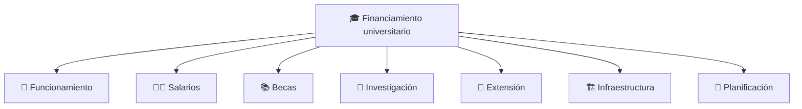
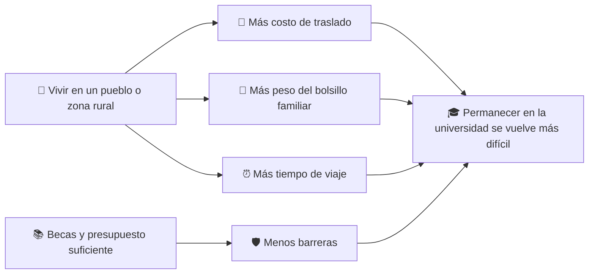

# 🎓 Universitarios marcharán el 15 de octubre por financiamiento, becas y salarios

La comunidad universitaria prepara una nueva movilización nacional.

La **Federación Universitaria Argentina (FUA)** convocó a marchar el **15 de octubre** en lo que será la **quinta Marcha Federal Universitaria**, con acompañamiento de **docentes, nodocentes y estudiantes**.

Entre los principales reclamos aparecen:

- 💰 mayor financiamiento para las universidades;
- 🏫 actualización de las partidas para funcionamiento;
- 📚 fortalecimiento de las becas estudiantiles;
- 👩‍🏫 recomposición de los salarios docentes y nodocentes;
- 🧾 discusión de las partidas universitarias en el **Presupuesto 2027**.

La noticia fue difundida por *La Tecla* a partir de declaraciones públicas de la FUA y de su presidente, **Joaquín Carvalho**.

👉 [Fuente periodística de la convocatoria: La Tecla](https://latecla.info/160465/universitarios-convocan-a-marchar-el-15-de-octubre)

---

## 📌 ¿Por qué marchan?

La universidad pública argentina atraviesa desde hace tiempo una discusión de fondo: **cómo se sostienen sus gastos básicos, sus salarios, sus becas y su capacidad de planificar a mediano plazo**.

Cuando el movimiento universitario habla de financiamiento no se refiere a una sola cosa.

Habla, al mismo tiempo, de:

- funcionamiento cotidiano de las universidades;
- luz, agua, gas, conectividad, insumos y mantenimiento;
- salarios docentes y nodocentes;
- becas para estudiar y permanecer;
- investigación;
- extensión universitaria;
- obras e infraestructura;
- previsibilidad para el año siguiente.

La marcha buscará que esa discusión no quede encerrada entre expedientes y planillas presupuestarias, sino que se convierta en un tema de agenda pública.

---

## 🧾 La discusión del Presupuesto 2027, en el centro de la protesta

Uno de los puntos más importantes de la convocatoria es la discusión del **Presupuesto 2027**.

Según la convocatoria difundida por la FUA, la comunidad universitaria rechaza la propuesta del Gobierno nacional para el sistema universitario y sostiene que **los recursos previstos resultan insuficientes** para cubrir las necesidades de funcionamiento, salarios y becas.

📌 **Al cierre de esta nota, Villars Informa no encontró publicado en una fuente oficial de acceso simple un desglose completo y consolidado de las partidas universitarias 2027 con ese porcentaje ya procesado y explicado para el público general.**  
Por eso, la referencia a que la propuesta cubriría “menos del 30 % de lo requerido” se presenta como **parte del reclamo universitario difundido en la convocatoria**, y no como un cálculo propio de esta redacción.

---

## 🏛️ ¿Qué significa “Ley de Financiamiento Universitario”?

En la convocatoria aparece otro punto central: el **cumplimiento de la Ley de Financiamiento Universitario**.

Ese reclamo sintetiza una discusión más amplia sobre la necesidad de garantizar por norma:

- actualización de gastos de funcionamiento;
- recomposición salarial;
- fortalecimiento de becas;
- mayor previsibilidad presupuestaria;
- una meta de inversión sostenida en educación universitaria.

Un documento clave para entender esa discusión es el **Proyecto de Ley de Financiamiento de la Educación Universitaria** difundido por el **Consejo Interuniversitario Nacional (CIN)**, donde se propone, entre otros puntos:

| Eje | Qué plantea el texto difundido por el CIN |
|---|---|
| 👩‍🏫 **Salarios** | Convocar paritarias para recomponer salarios docentes y nodocentes |
| 🏫 **Funcionamiento** | Actualizar partidas para gastos de funcionamiento |
| 📚 **Becas** | Fortalecer becas para estudiantes |
| 📈 **Meta presupuestaria** | Incremento progresivo hasta alcanzar el **1,5% del PBI** destinado a educación universitaria hacia 2031 |
| 🏗️ **Infraestructura** | Prever recursos para obras y equipamiento |

👉 [Proyecto de Ley de Financiamiento de la Educación Universitaria — CIN (PDF)](https://www.cin.edu.ar/descargas/ProyectoLeyFinanciamientoUniversitario.pdf)

⚠️ **Aclaración importante:** el movimiento universitario utiliza la expresión “Ley de Financiamiento Universitario” en su reclamo político e institucional. En esta nota, Villars Informa distingue cuidadosamente entre el **reclamo por cumplimiento y financiamiento**, y los distintos textos normativos o proyectos que circulan en la discusión pública.

---

## 👩‍🎓 ¿Por qué esto importa tanto para estudiantes de sectores populares?

Porque la universidad pública no se sostiene solamente con aulas abiertas.

Se sostiene también con condiciones materiales para que alguien pueda **entrar, permanecer y recibirse**.

Para una familia trabajadora o rural, estudiar suele implicar:

- 🚆 transporte;
- 🍽️ comida;
- 📱 conectividad;
- 📚 materiales;
- 🏠 alquiler o residencia en algunos casos;
- ⏰ compatibilizar estudio con trabajo.

Si el presupuesto se achica o no alcanza, el impacto no siempre se ve primero en un titular. A veces aparece así:

- menos becas o becas atrasadas;
- comedores con dificultades;
- cursadas afectadas;
- renuncias o desgaste del personal por salarios;
- obras frenadas;
- laboratorios con menos recursos;
- menos extensión en barrios y pueblos.

> 🎓 **Cuando se debilita el financiamiento universitario, el golpe no cae igual para todos: pega más fuerte sobre quienes necesitan más apoyo para poder estudiar.**

---

## 🌾 ¿Y qué tiene que ver esto con Villars, Las Heras y la zona rural?

Muchísimo.

En pueblos y zonas rurales, la universidad pública representa varias cosas al mismo tiempo:

- una posibilidad real de **movilidad social**;
- una salida profesional para jóvenes que son primera generación universitaria;
- formación para docentes, enfermeros, ingenieros, técnicos, trabajadores sociales y profesionales que después vuelven a sus comunidades;
- investigación y extensión que impactan fuera de las grandes ciudades.

Para muchas familias del interior, el acceso universitario ya viene con una desventaja material previa: más kilómetros, más costo de traslado y menos margen económico.

Por eso, cuando se discuten becas o presupuesto, no se discute sólo “caja”: se discute **quién puede seguir estudiando y quién corre riesgo de quedar afuera**.

---

## 🧭 ¿Qué hace cada nivel del Estado?

Acá es importante separar responsabilidades.

| Nivel del Estado | Qué le corresponde principalmente |
|---|---|
| 🇦🇷 **Nación** | Financia el sistema universitario nacional, define las partidas en el presupuesto, ejecuta becas nacionales y fija la política universitaria general a través de la Secretaría/Subsecretaría correspondiente |
| 🟦 **Provincia** | Puede complementar con políticas de transporte, acompañamiento estudiantil, articulación educativa y respaldo institucional a universidades ubicadas en su territorio |
| 🏘️ **Municipios** | Pueden acompañar con becas locales, transporte, centros universitarios, convenios, apoyo territorial y reclamos institucionales, aunque no financian el sistema universitario nacional |

👉 [Página oficial de Universidades — Argentina.gob.ar](https://www.argentina.gob.ar/capital-humano/educacion/universidades)

### 📝 Qué encontramos para nuestra zona

Al cierre de esta nota, **no encontramos un anuncio municipal específico de General Las Heras vinculado a esta convocatoria del 15 de octubre**.

Sí es válido señalar que, para estudiantes del interior, cualquier medida de acompañamiento local en transporte, orientación, becas o centros universitarios puede hacer una diferencia muy concreta en el bolsillo.

---

## 📚 Becas: una palabra chica para un problema grande

Cuando se habla de financiamiento universitario, las becas suelen aparecer como un tema más. Pero para muchísimos estudiantes son la diferencia entre **seguir o abandonar**.

El propio sitio oficial del área de Universidades del Estado nacional mantiene como parte de sus políticas a las **Becas Manuel Belgrano** y otras herramientas de apoyo.

👉 [Becas Manuel Belgrano — sección oficial de Universidades](https://www.argentina.gob.ar/capital-humano/educacion/universidades)

El proyecto de financiamiento difundido por el CIN también menciona la necesidad de fortalecer partidas destinadas a becas estudiantiles y revisar criterios de acceso para favorecer la permanencia.

En términos concretos, esto afecta sobre todo a quienes:

- trabajan mientras estudian;
- se trasladan desde distritos alejados;
- alquilan o viven en pensiones;
- tienen hijos;
- son primera generación universitaria;
- dependen de ingresos familiares muy ajustados.

---

## 👩‍🏫 Salarios universitarios: el otro corazón del conflicto

La universidad pública no funciona sólo con edificios. Funciona con personas.

El reclamo universitario también pone en primer plano la situación salarial de:

- docentes;
- nodocentes;
- investigadores vinculados al sistema;
- equipos técnicos y administrativos.

Cuando los salarios pierden frente a la inflación o quedan atrasados, la universidad enfrenta problemas que van más allá del sueldo individual:

- dificultades para sostener equipos;
- pluriempleo;
- desgaste;
- pérdida de horas de dedicación;
- menor previsibilidad académica;
- dificultades para investigación y extensión.

El proyecto difundido por el CIN coloca la **recomposición salarial** entre sus puntos principales.

---

## 🔍 Qué está confirmado y qué no

### ✅ Confirmado

- La **FUA convocó** a una movilización para el **15 de octubre**.
- La convocatoria involucra a **estudiantes, docentes y nodocentes**.
- Entre los reclamos centrales figuran **financiamiento, becas, salarios y presupuesto 2027**.
- El sistema universitario nacional cuenta con una estructura y políticas oficiales bajo el área de **Universidades** del Estado nacional.
- Existe un **Proyecto de Ley de Financiamiento de la Educación Universitaria** difundido por el **CIN**.

### ⚠️ Debe seguirse

- El detalle definitivo de las **partidas universitarias del Presupuesto 2027**.
- La evolución institucional del reclamo por la llamada **Ley de Financiamiento Universitario**.
- Las definiciones concretas sobre becas, salarios y ejecución presupuestaria.
- Si habrá adhesiones formales de universidades, gremios y centros de estudiantes de nuestra región.

---

## 💬 El debate de fondo: universidad pública o universidad para pocos

La discusión no es sólo técnica. También es social.

Cuando se ajusta el financiamiento de las universidades públicas, el impacto no se mide solamente en balances: se mide en trayectorias interrumpidas, en investigación que no despega, en jóvenes que abandonan y en familias que ven cerrarse una oportunidad histórica de ascenso social.

Al mismo tiempo, no alcanza con una marcha si después no hay resolución institucional del conflicto.

Por eso el 15 de octubre aparece, para el movimiento universitario, como una fecha para instalar una pregunta de fondo:

> **¿La universidad pública será tratada como una inversión social estratégica o como un gasto a recortar?**

---

## ❤️ Lo que está en juego para la comunidad

Para una comunidad popular, la universidad pública no es un lujo.

Es:

- una puerta de entrada a profesiones;
- una herramienta de igualdad;
- un sostén de ciencia y conocimiento;
- una red de extensión que muchas veces llega a barrios y pueblos;
- una promesa concreta de que estudiar puede cambiar una vida.

Por eso esta convocatoria excede el ambiente universitario.

Afecta a estudiantes, trabajadores de la educación, familias y también a los pueblos que ven en la universidad un camino para no expulsar a sus jóvenes.

> 🎓 **Defender la universidad pública no es sólo defender un edificio o una partida: es defender la posibilidad de futuro para quienes más necesitan que el estudio siga siendo un derecho y no un privilegio.**

---

## 📚 Fuentes consultadas

- **La Tecla** — convocatoria al 15 de octubre y declaraciones de la FUA:  
  https://latecla.info/160465/universitarios-convocan-a-marchar-el-15-de-octubre

- **Argentina.gob.ar — Universidades**:  
  https://www.argentina.gob.ar/capital-humano/educacion/universidades

- **Argentina.gob.ar — Consejo de Universidades**:  
  https://www.argentina.gob.ar/educacion/universidades/consejo-de-universidades

- **Consejo Interuniversitario Nacional (CIN)** — Proyecto de Ley de Financiamiento de la Educación Universitaria (PDF):  
  https://www.cin.edu.ar/descargas/ProyectoLeyFinanciamientoUniversitario.pdf

- **Argentina.gob.ar — Información universitaria / publicaciones**:  
  https://www.argentina.gob.ar/educacion/universidades/informacion/publicaciones/sintesis

---

**Redacción, investigación y adaptación: Villars Informa.**

Artículo elaborado con base en la convocatoria difundida públicamente por la FUA a través de medios periodísticos, complementado con documentación oficial del área nacional de Universidades y el proyecto de financiamiento difundido por el Consejo Interuniversitario Nacional. **La redacción es propia** y distingue entre hechos confirmados, reclamos sectoriales y discusiones presupuestarias aún en curso.
